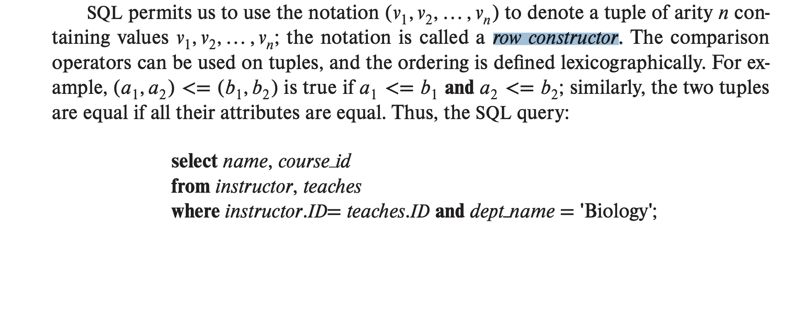
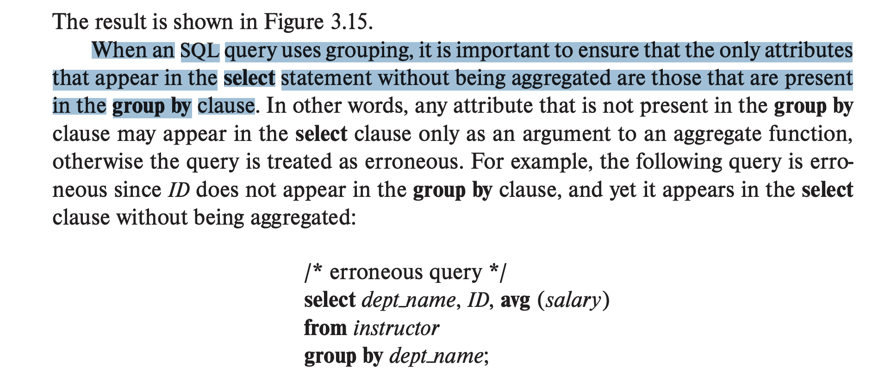
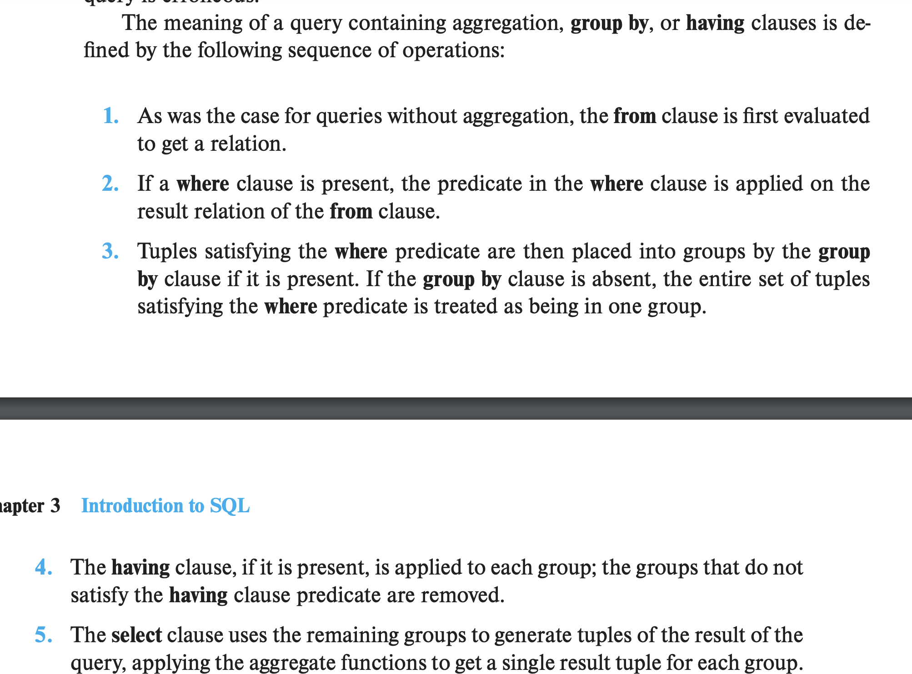

# Relational Calc
Created Thu Nov 21, 2024 at 4:02 AM

- Relational Algebra representation is the innovation that makes SQL optimizers possible. the optimizing programs follow the algebra.
- Multiple tables FROM clause.
- row constructor. no need of so many ANDs.
	
- UNION, INTERSECT and EXCEPT (difference) are supported in SQL. They do it between relations (table records.)
	- UNION removes duplicates by default, use UNION ALL to keep duplicates.
- Ack for GROUP BY and SELECT clause should match, otheriwse error:
	
- HAVING clause is not like WHERE. HAVING WORKS on groups after they have formed, and removes a whole group if not satisfied. proof in exec order:
  
- Aggregate functions ignore NULL values, except `COUNT`.
  > Rather than say that the overall sum is itself null, the SQL standard says that the sum operator should ignore null values in its input.
  

Resume page 98