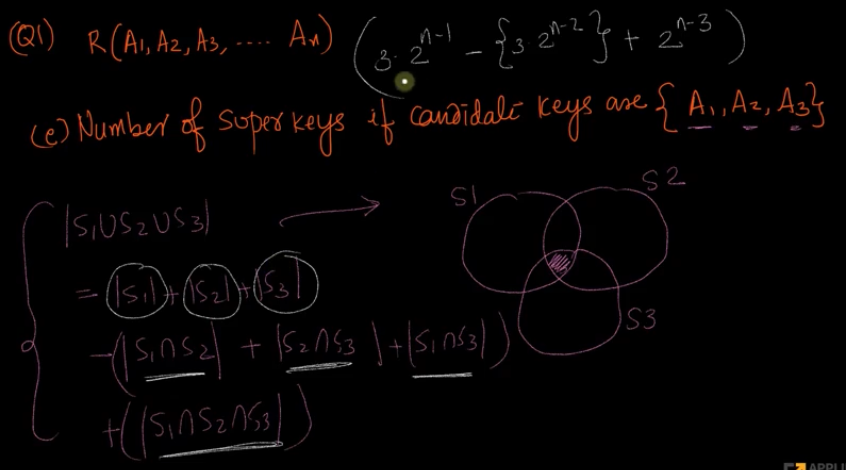

# 5. Solved problems
Created Fri Mar 22, 2024 at 7:56 AM

Introduction section's problems

Q1. Given table R(A1, A2, A3, ... An). 
a. Number of super keys if candidate keys are {A1}. Answer: 2n-1
b. Number of super keys if candidate keys are {A1, A2}. Answer: 3 \* 2n-2
c. Number of super keys if candidate keys are {{A1, A2}, {A3, A4}}. Answer: 3 \* 2n-4
d. Number of super keys if candidate keys are {{A1, A2}, {A2, A4}}. Answer: 3 \* 2n-3
e. Number of super keys if candidate keys are {{A1, A2, A3}}. Answer: 7 \* 2n-3
	

Q2. Given a relation with n attributes, how many superkeys can be present. A: no candidate key. 2n - 1. -1 because null set cannot be a super key.