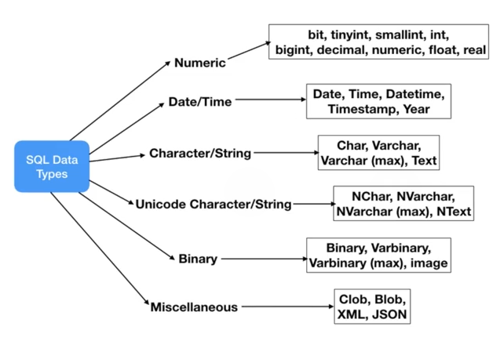

# 1. CREATE TABLE
Created Sat Apr 13, 2024 at 1:52 PM

## `CREATE`
Create a table.
```sql
CREATE TABLE table_name 
(colName type extras...), 
(colName type extras...)
...; 
```

Note:
- `extras` refers to constraints and other fine grained setup.
## Data types
Some types are just one word, while others take a param (like varchar).

Here's a list. Note that not all databases support all types.


So, there are basic types like 
- precise numbers, float numbers
- date, time, timestamp (UNIX)
- fixed sized strings, max-size-fixed strings, dynamic size strings, unicode strings.
- types for storing binary data, images
- Special purpose data like JSON, XML, Blob


## Constraints
These are constraints on values that are stored in a given column. The databases always validates these, after all operations, and throws and error if they're not satisfied.

- NOT NULL - cell value cannot be null. Otherwise throw error.
- UNIQUE - all values in the column are unique. NULL's are acceptable and ignored for uniqueness.
- PRIMARY KEY - NOT NULL and UNIQUE. meant to act as row identifier
- FOREIGN KEY - a link (i.e. primary key of row) to another table
- CHECK - user defined constraint. Throws error if not met. Example: value > 0
- DEFAULT - default value for a column if not specified
- INDEX - a construct defined for a given column that speeds up reads and joins. May hamper writes. Practically, a table almost always has an index on some column.