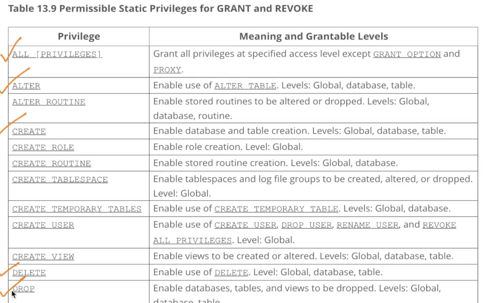

# 1. Data Control Language GRANT REVOKE
Created Wed Apr 17, 2024 at 12:07 AM

start https://www.scaler.com/topics/course/dbms/video/504/

[GRANT docs](https://dev.mysql.com/doc/refman/8.0/en/grant.html)

## Why
A database in a project is usually used by almost all kinds of people - engineers, analysts, sales, data-scientists etc.

The fact is that not all of these users need or even be allowed to access all data, due to concerns like:
1. Privacy
2. Regulation
3. Maintain quality of data, i.e. so nobody makes a mess
4. New/old employees - permissions for employees who leave need to be removed, and for new employees to be added.

This requires a feature where one can represent the users of the database and also set permissions for allowed actions and parts of the database they can access.


## How
The user structure of authorization is usually two fold:
1. Permissions for users. Direct.
2. Permissions for roles - i.e. a class of users, and each user can have one more roles.

The permission part is usually 'SELECT', 'DROP' or any other operation allowed by the database.
Then there exists the focus part - i.e. what and where all can the user do something.

Essentially, we just execute statements containing these 3 things - target user(s), permission(s), target area (s).


## What - Data control language (DCL)
The term for this feature in databases is called DCL (Data control language).

DCL is a component of most SQL databases.

## DCL commands in SQL
There are two:
1. [GRANT](https://dev.mysql.com/doc/refman/8.0/en/grant.html) - obvious used to give permissions. Takes are argument the permission, user/role, the database/table where permission will apply.
2. [REVOKE](https://dev.mysql.com/doc/refman/8.0/en/revoke.html) - used to remove permissions. Same input structure as GRANT.
3. BAN - not a MySQL thing. But is used to temporarily take away access.

```sql
REVOKE INSERT ON *.* FROM 'jeffrey'@'localhost'; -- *.* means all databases and all tables inside them

REVOKE 'role1', 'role2' FROM 'user1'@'localhost', 'user2'@'localhost';

REVOKE SELECT ON world.* FROM 'role3';

--

GRANT ALL ON db1.* TO 'jeffrey'@'localhost'; -- give jeffrey ALL permissions all tables of 'db1' database

GRANT 'role1', 'role2' TO 'user1'@'localhost', 'user2'@'localhost'; -- set role for users

GRANT SELECT ON world.* TO 'role3'; -- give all role3 users SELECT permission for all tables of 'world' database
```

Some permissions: 

## Practical gotchas
TBD