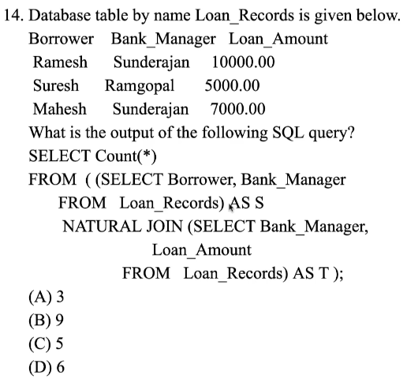

# 4. Solved Problems 2
Created Sun Apr 21, 2024 at 9:04 PM

6. `SELECT` in SQL is *mostly like* projection with duplicates in RA. But, note that `SELECT` :
	1. Is confusingly named between SQL and RA, since `SELECT` does RA projection instead of RA selection.
	2. `SELECT` may be like projection in RA. But it has other powers too like aggregation, deduplication, GROUP BY (the `SELECT` works on returnage from grouping, instead of the original rows from `FROM`).
7. Group by aggressively determines count, so 3, but there's a duplicate on the group by, and two such entries, that means, they'll be together in a group, so finally 2. *mental note, make sure to see duplicates on the GROUP BY criteria*
8. Revise any, all. They are used to compare all rows of subquery with a row of the main query, one at a time. We want theatres with maximum capacities. Now the subquery is on the same table, so any strict greater-than will just result in an empty-result. And greater-than-or-equal-to will return the theatre(s), i.e. maximal set.
9. S1 - A foreign key declaration can always be replaced by an equivalent check in SQL. 
	   *Answer* - verification wise, yes, but it's not completely equivalent, since foreign key errors have the ability to trigger a cascading action, which 'CHECK' does not. So *FALSE statement*.
	S2 - Given the table R(a,b,c) where a and b together form the primary key, the following is a valid table definition. 
	```sql
	CREATE TABLE S(
	a INTEGER,
	d INTEGER,
	e INTEGER,
	PRIMARY KEY (d),
	FOREIGN KEY (a) references R)
	```
	*Answer* - the definition is good, except the foreign key part. The definition of foreign key requires the linked column(s) to be a primary key, or atleast a key (uniquely determining column(s)), otherwise the link would have ambiguous destinations. In this problem, only part of the primary key is being used for the FK in S, and may have duplicates, so this is not a valid table definition. So *FALSE statement*.
10. Statement is fine.
11. 
    Option A has extras. B has too much filtering. C is OK. D looks complex, but don't have to consider UNIQUE R, since cross product will produce a lot of results. *Idk if option D is valid SQL or what it means*.
12. Simple, double negation is the important part to catch. 
13. The important thing here is to know `ALL` of empy set is TRUE (like JS's every). 
14. Answer: 5 