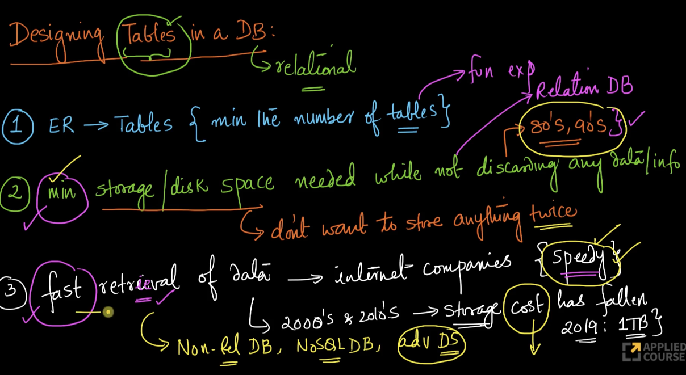

# 1. Designing tables in a DB
Created Tue Apr 23, 2024 at 1:33 AM

Video: https://www.scaler.com/topics/course/dbms/video/509/

## What objectives to have when designing DBs?
When making tables in relational databases, what should be our objectives and how do they change when requirements are different?

We have some idea of goals:
1. ER2T - the algorithm used to create tables from ER diagrams. The goals here were - minimize number of tables, each table has primary key and that a cell value must be a single value (i.e. not array)
2. Minimize storage space - was a goal (of course, we don't want to discard any data too) in the 80s, 90s. 
	- But it's not a very important thing today, since memory is cheap. 
	- This essentially means we minimize duplication. 
	- Generally, time optimization (read/write speeds) is not the main goal.
	- Most DBMS study material focuses on this, since the material was written during 80s, 90s.
3. Fast retrieval of data (speed) - this is very relevant for Internet companies like Google, Amazon. 
	- This is empirically valid since it has been established that even a 100ms lag can cause users to jump to alternatives. 
	- Generally, space optimization is not the main goal here.
	- This has led to non-relational databases like document, key-value etc, since space is not the main concern today, generally speaking.

## In this module
- In this section, we'll mostly focusing on design aspects that help goal 2, i.e. minimizing disk space while not discarding any information. Concepts involved here are:
	- Functional dependencies
	- Decomposition
	- Normalization forms
- At the end, we'll also learn about design aspects when for goal 3 (i.e. speed).