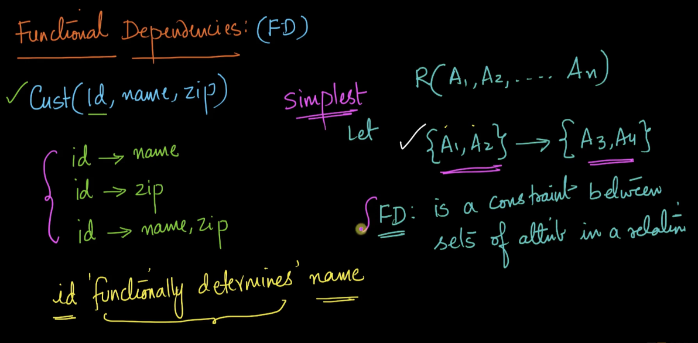
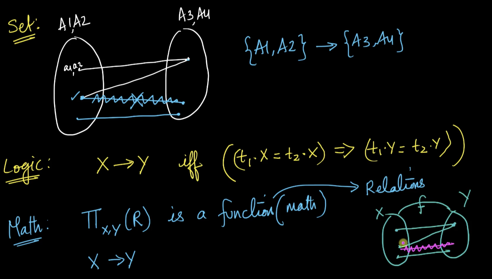
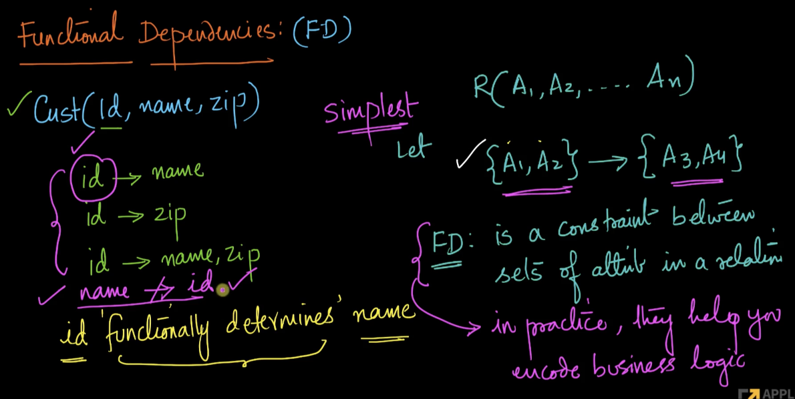
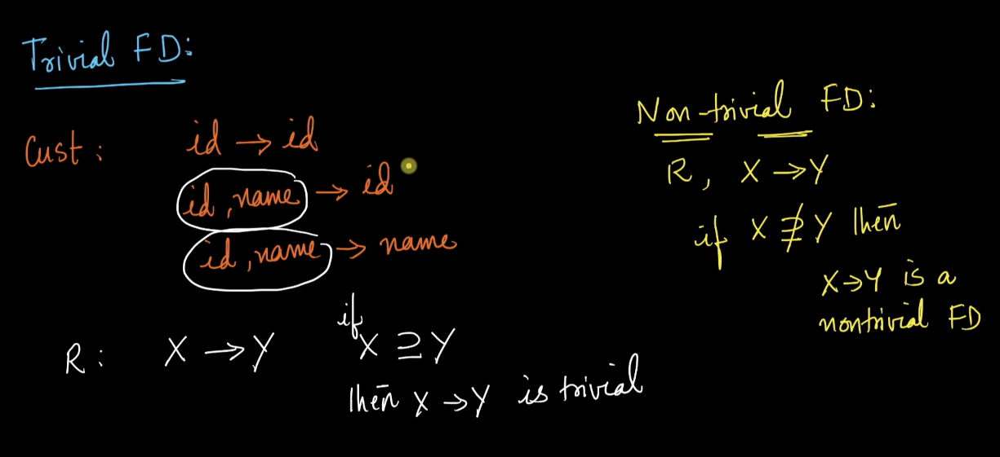
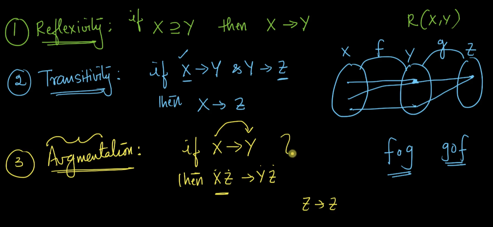
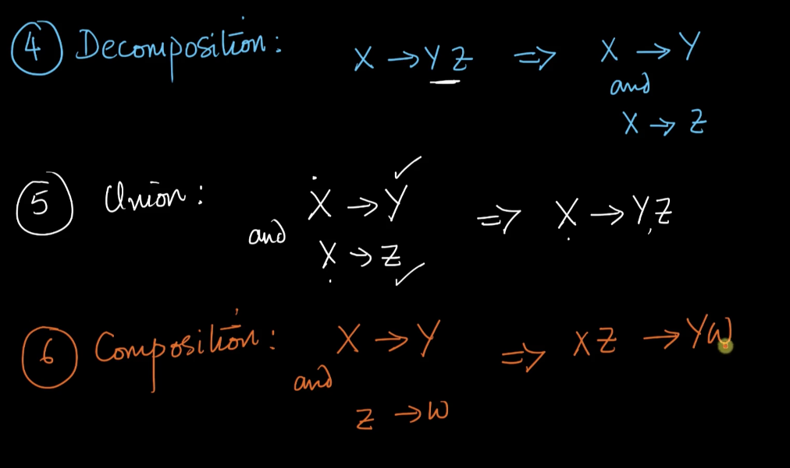
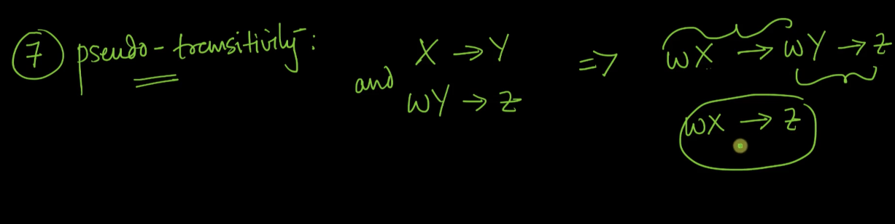
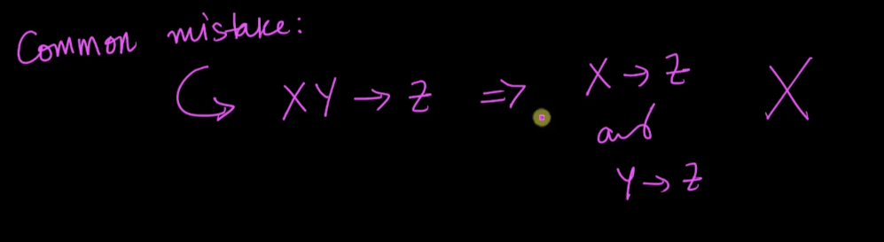
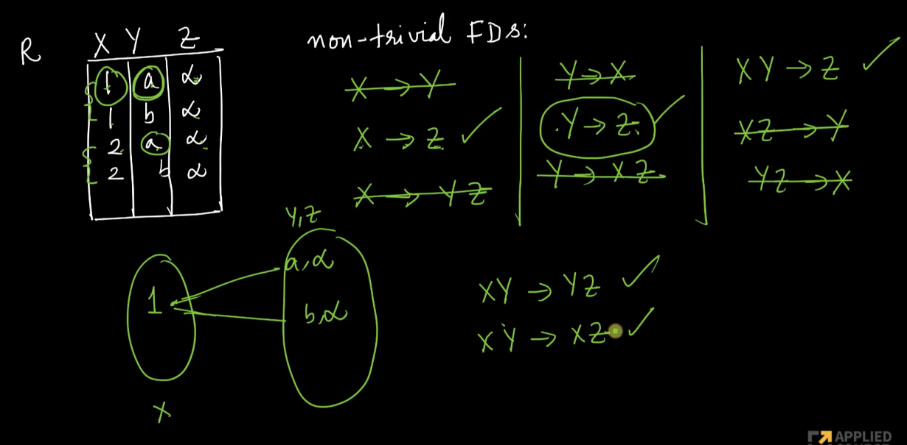

# 2. Functional Dependencies
Created Tue Apr 23, 2024 at 11:14 PM

Video: https://www.scaler.com/topics/course/dbms/video/510/

## FD - jargon
FD is short for "functional dependencies".

In the following picture, knowing `id` is enough to determine `name`. This is communicated as "id functionally determines name". Note the answer is fixed for a given the input (i.e. id).

Note:
- FDs are one way, i.e. two ids above can have the same name, fine. But the same id cannot have two different names.
## FD - definition

If this diagram is true, then {A1, A2} *do not* determine {A3, A4}. i.e. exactly like mathematical definition of a "function".

Here are 3 equivalent definitions:

Notation wise, we'll be using X -> Y to mean X functionally determines Y, where X and Y are a set of attributes, of a relation (R). We'll also drop "functionally", and just say "X determines Y".

## FD - use
Practically, FD helps us encode business logic. HOW? (will discuss)

Here the id to name "FD" helps enforce that determining id given name is not possible (the opposite is possible, i.e. the FD). We have encoded a negative (restriction) in this example.

## FD types
- Trivial: if you know (or are given) more attributes than you need, then you can determine a subset of the given (that you know) attributes. Obvious. Definition is simple set inequality.
- Non-trivial: an FD where you are able to determine value of an attribute even if you don't know it directly. Definition is simple set inequality.

See below for more clarity:

## Inference rules
How to get FDs of a problem/system:
1. By inspection - i.e. from the nature of domain of the problem. Example of problems: search engine app, shopping app.
2. By using established inference rules - create rules to obtain new FDs from existing ones. These rules are known as inference rules.

The inference rules:
1. Reflexivity - if X is a superset of Y, then X determines Y.
2. Transitivity - if X -> Y and Y -> Z, then X -> Z. Comment: a tuple of X has a fixed tuple Y, and the tuple Y has a fixed tuple Z, then tuple X has a fixed tuple Z. Simple math function definition.
3. Augmentation - if X -> Y, then XZ -> YZ. Comment: simple concatenation of attributes maintains functional dependency, yes, obviously. Pre-augmentation is also possible.
4. Decomposition - if X -> YZ, then X -> Y and X -> Z. Comment: reverse of concatenation, and the fact that FD is on attribute sets on the same relation (so there can't be free Y and Z, i.e. free from X).
5. Union - if X -> Y and Y -> Z, then X -> YZ. Comment: concatenation
6. Composition - if X -> Y and Z-> W, then XZ -> YW. Comment: concatenation
7. Pseudo-transitivity - if X -> Y and WY -> Z, then WX -> Z. Comment: pre-augmentation (WX -> WY) and transitivity (WY -> Z), leads to WX -> WY.

Note:
- Inference rules apply to FDs on the *same* relation.
- How does FD really help? Well:
	1. It can help answer, given a system already exists, if known information will be enough to know some other piece of related information. Or help in knowing minimum attributes that can help determine a target attribute. *Maybe help in API design and for avoiding unnecessary changes if the current information may be enough*.

## FD - examples/problems
Green ones are questions for FD.

Two processes were involved here, basic function (i.e. fixed output for same input check), and applying inference rules to generate new FDs (like the 2 on bottom right side).