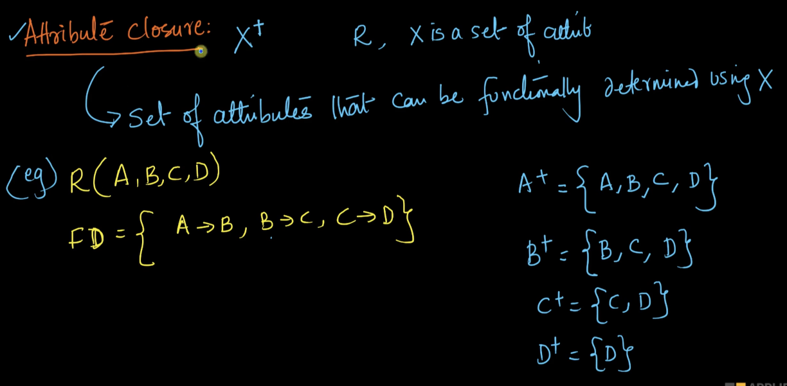
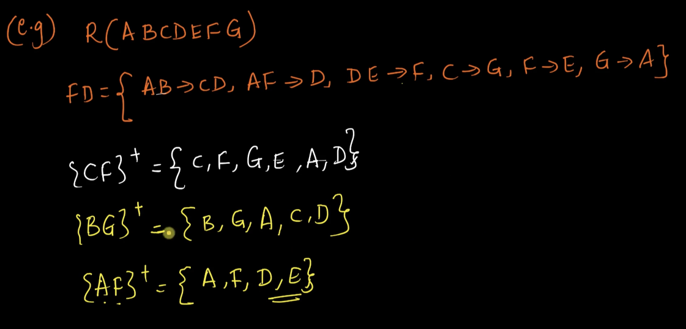
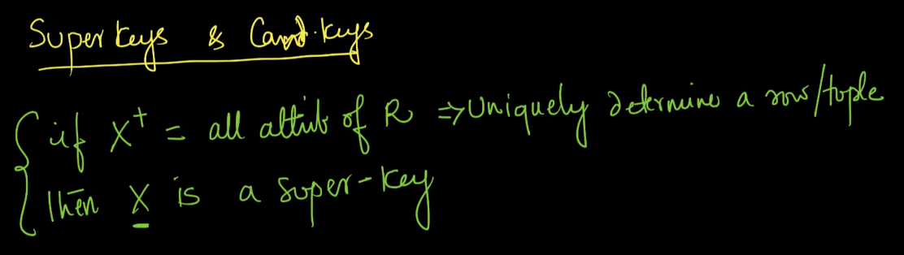
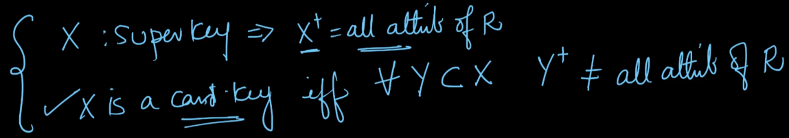
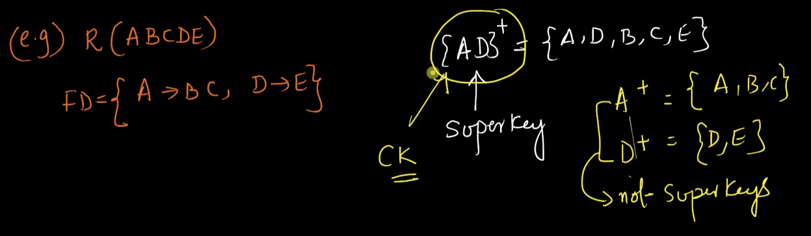
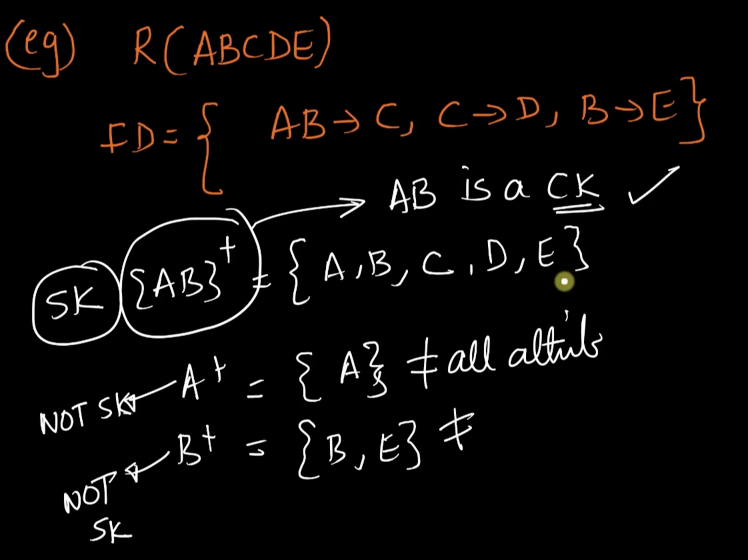
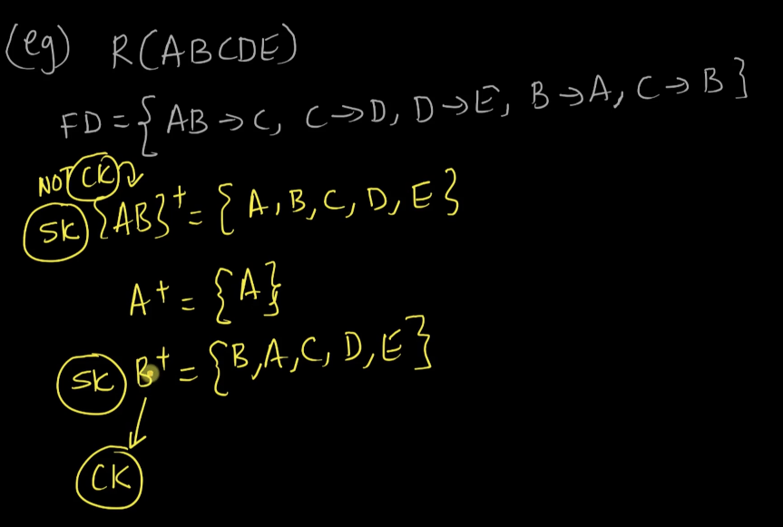
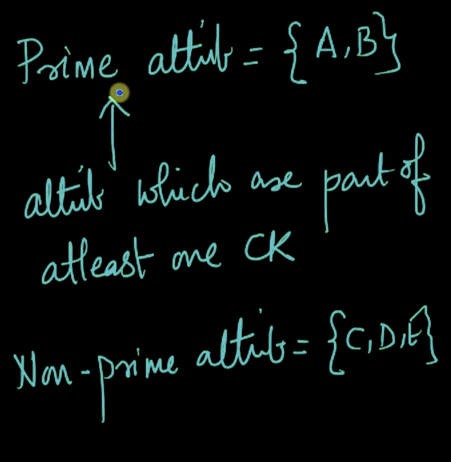
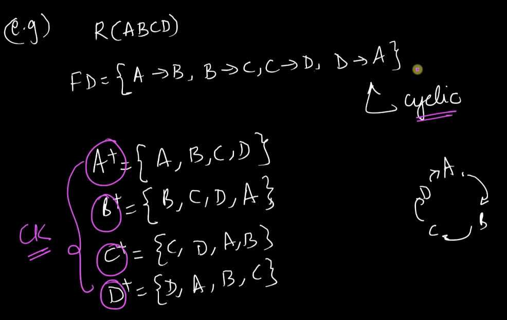
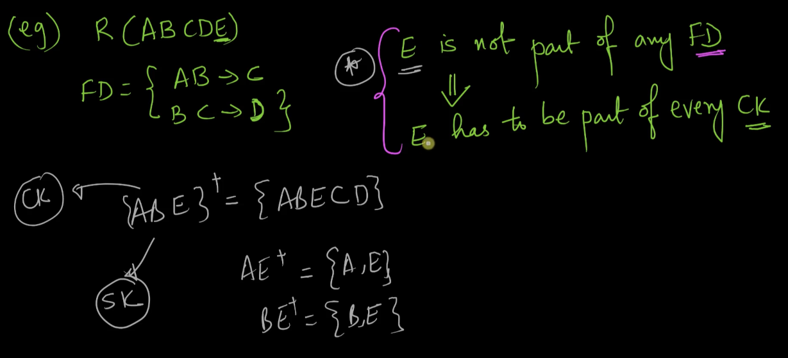

# 3. Attribute Closure Keys and Solved problems
Created Wed Apr 24, 2024 at 12:03 AM

Continue from: https://www.scaler.com/topics/course/dbms/video/511/ (24: 30 mark)
## Attribute closure
The attribute closure notation is X+ where X is a set of attributes of a relation R.

What does it mean? The attribute closure of X equals (or gives) the set of *all* attributes that can be determined by some subset of X.

In the following example, we are given FDs of the relation R, and we are answering for output of attribute closure of the sets of attributes A, B, C, D.

But how is this helpful? Lets take another example. What Srikant is doing here:
1. Given a attribute closure to determine, he notes down the trivial attributes.
2. Then tries to use existing output and given FDs to add more stuff to output.
	He uses the inference rules to check and construct FDs too, during this process.

## Super keys
One use of "attribute closure" is that it can be used as a check if a given attribute-set is a super key or not.

Suppose you are given a relation R and a attribute set X on it.
You compute X+, and if it happens to equal "all attributes of R", then X is a super key, otherwise it's not a super key.

So attribute closure is used to *verify* claim of being super key. Does not help with *generation* directly.

## Candidate keys
Recap what candidate keys are, they are a set of attribute such that no strict subset from the given set, can be a super key. i.e. a candidate key is a minimal super key.

How is attribute closure relevant here? Well, if you're given an attribute set X of relation R, and it is claimed X is a candidate key. To verify, we form subsets of X, and calculate "attribute closure" of the subsets (strict subsets). If any one of the output happens to be "all attributes of R", then it means X is not a candidate key. Otherwise X is indeed a candidate key. Note that null set is neither a SK nor a CK.

So attribute closure is used to *verify* claim of being candidate key. Does not help with *generation* directly.

Directly, this helps check what to use as PK, since PK is usually picked from the set of candidate keys (and candidate keys and usually given/known).

## Examples
1. Analyse if AD is a SK, a CK given R and FDs
	
	Yes: AD is a SK. and also a CK.
2. Analyse if AB is a SK, a CK given R and FDs
   
   Yes: AB is a SK. and also a CK.
3. Analyse if AD is a SK, a CK given R and FDs 
   
   Yes: AB is a SK. But AB is not a CK.

## Prime attributes
Assume you're given a set of attributes on R, and a candidate key (aka CK).

Then the prime attributes of R is *a set* that has all attributes from the given candidate key, plus any other attributes that don't make the set a super key.

Of course, primary attributes is a superset to candidate key.

Q1: How would this be possible, isn't a candidate key minimal.
A: yes, the candidate key is minimal. But it can happen that an attribute not mentioned in the CK determines an attribute present in it. In this case this unmentioned attribute gets to be included in the "primary attribute" set. *i.e. candidate keys plus stupid attributes (determining wise)*.

Q2: This means prime attributes change w.r.t to candidate key in hand.
A: Yes, since there can be multiple CKs for a table, that means there can be multiple prime-attribute-sets for a table. This is fine, since any of these is enough to be used for uniqueness. Think of it as multiple options to arbitrarily choose from.

### Examples
Most problems here was given R, FD list and a key-set, check if the key set is a SK, and is it a CK?

Below: if an attribute is not a part of FD list, then that attribute is a part of every candidate key.

LATER: what's the use of primary attributes, if CK are enough?