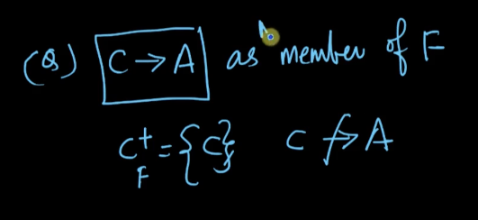
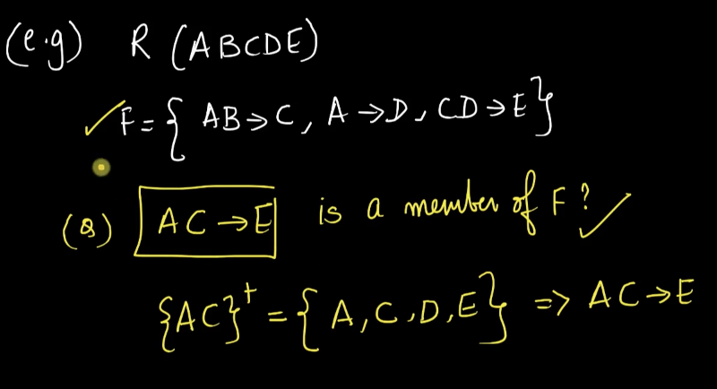

# 4. Functional Dependency Sets and PropertiesSolved examples
Created Wed Apr 24, 2024 at 11:12 PM

"FD-set" means the FD list we have seen as given in problems until now.
Note that this is just *a* set, it doesn't have to be exhaustive/complete.

## Properties of FD set
1. Membership: Let F be an FD-set on R, then. X -> Y is said to be a member of the F, if Y is a subset of X+ (using F, i.e. X+ was computed using given F). *Makes sense. i.e. X -> Y may not not seem to be trivially part a member of F, but computing X+ solves this doubt, since it essentially generates all FDs with left part as X*.
   Below 1 (yes, claim is true)
   
   Below 2, not a member (claim is false).
   
   Below 3, yes, claim is true.
   
   Below 4, yes, claim is true.
   
2. Closure of an FD-set (denoted by F+): the set of all FDs that can be derived given an FD set F on R.
   Systematic way of computing closure. Start with 0, and calculate all sized "attribute closures". Finally, count sum of sizes of attributes closures formed. Example below:
   
   
3. Equality of FD-sets: since multiple SKs, CKs and prime attributes are possible, two people working on the same project could form different FD-sets. It is usually a task here to check whether the two FD-sets are equivalent. 
   There are two methods: 
	   1. one involves direct enumerations, and comparison of output.
	   2. Another involves using the concept of covering - which is partially based on enumeration and partially on inference rules (i.e. requires some intuition and inspection).
   
   Example 1 (demonstrating method 2), essentially, use attribute closures and intuition to check if FDs in other set are creatable.
   
   Example 2:
   