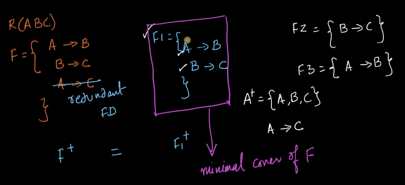
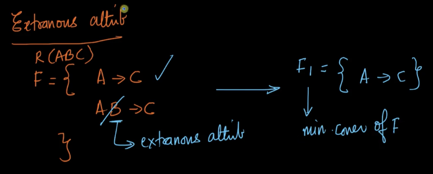
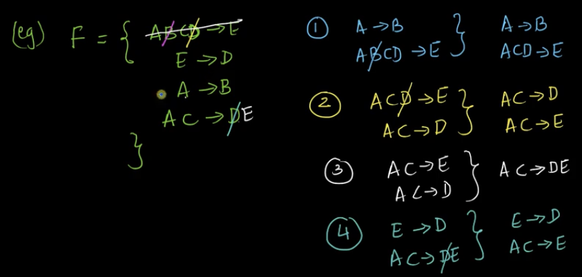
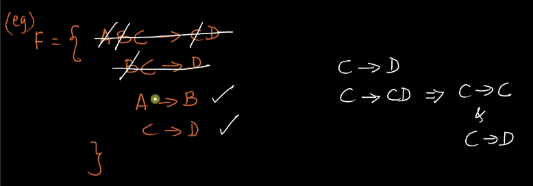
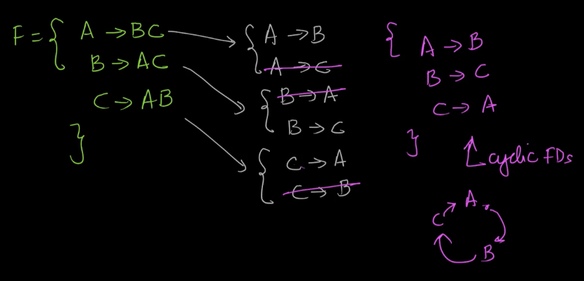
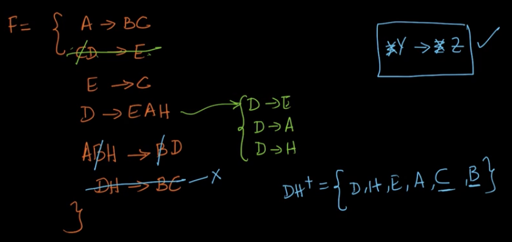

# 5. MinimalCanonical Covers of FDssolved problems
Created Fri Apr 26, 2024 at 12:44 AM

Start video: https://www.scaler.com/topics/course/dbms/video/513/
## Minimal (aka canonical covers) cover of an FD-set
Given an FD-set, the corresponding "minimal cover" is FD-set is produced if all redundant FDs are removed from the given set. *Information wise, minimal covers and the given FD set are equivalent*.

Example (minimal cover)

## Practical importance of FD-cover
Minimal cover are a minimal set. And FDs are implemented in SQL via CHECK or PRIMARY key constraints. Since the set is minimal, the number of constraints is also minimal. Thereby helping with performance of the DB.

There are two parts:
1. Minimize number of FDs
2. Remove extraneous attributes

## Extraneous attributes
In addition to minimizing the number of FDs in an FD-set, minimizing (removing attributes) from FDs is also an important part of minimal cover.

An attribute can only be removed, if its removal causes no change to the expressive power of the minimal cover. Such attributes are called extraneous attributes. These can be on LHS as well as RHS.

## Method - finding minimal cover
Steps:
1. Find FDs with the same LHS, and remove FDs which have a common subset in RHS (keep the smallest RHS one, remove the rest).
2. Remove extraneous attributes (removal could be in LHS or RHS, or both)
3. Repeat step 1 and 2 until you can make no change.

Example of minimal cover

Here, eventually we get, AC -> DE and E -> D, and using this, we can drop D in the RHS (in 1st FD), to get AC -> E, and E -> D. *So RHS dropping of extraneous attribute is possible as well.*

Example 2:

Example 3 (here we couldn't reduce number of FDs but extraneous attributes have been removed, this is fine):

Note: Getting minimal cover feels like Matrix multiplication and Boolean algebra. Generative/doable manually

Example 4 large example. Stopping algo detection (i.e. reached minimal cover) hand wavy but ok.
