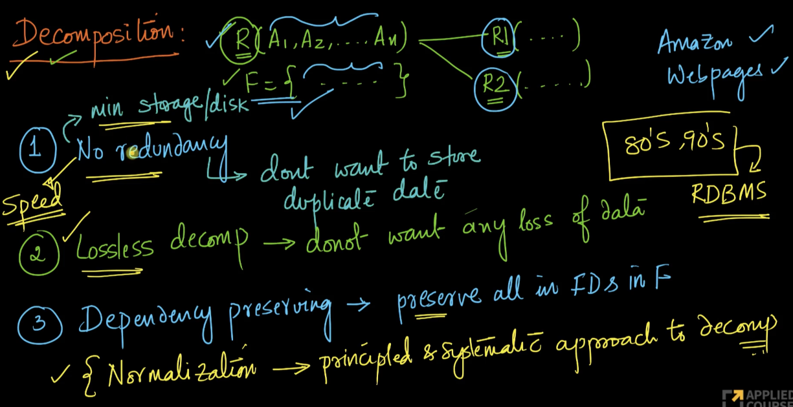
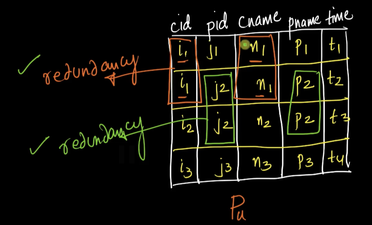
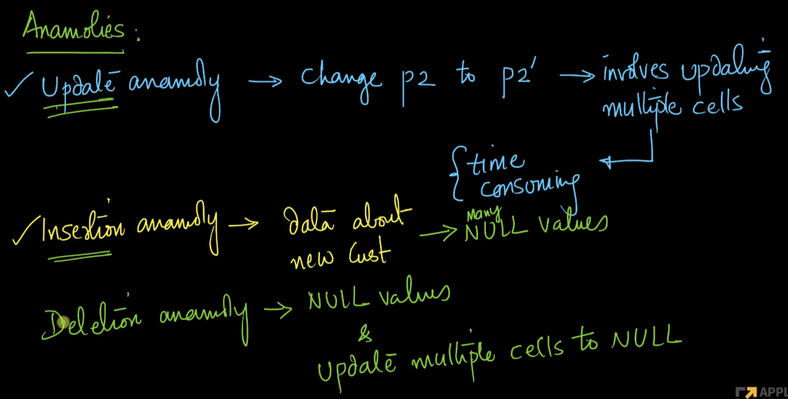
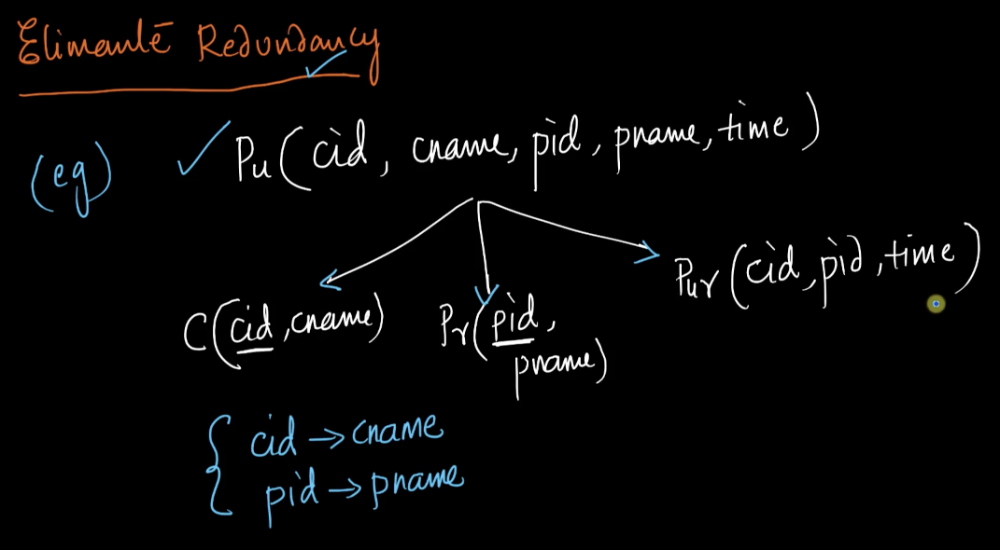
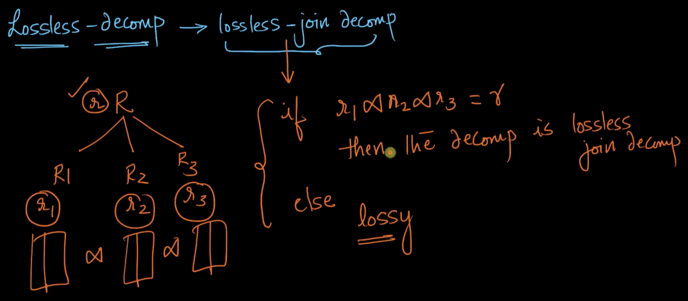
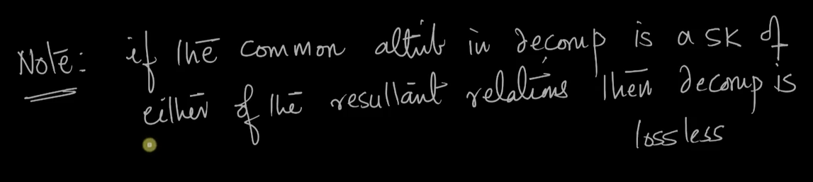

# 6. Decompositions with solved problems
Created Fri May 3, 2024 at 10:46 PM

Video: https://www.scaler.com/topics/course/dbms/video/514/
## What is decomposition
By decomposition we mean process of breaking down a given table in multiple tables.
This is done for various reasons, one of them is minimizing redundancy (save on storage space).

## Decomposition requirements
A decomposition operation needs to ensure the following 3 requirements:
1. No redundancy among the decomposed table.
2. Lossless decomp - there should be no data loss.
3. Dependency preserving - all FDs should be preserved.

## Redundancy anomalies - one reason to decompose a table
If a table has redundant information, the following 3 anomalies are possible:
1. Update anomaly - multiple rows may need to be updated
2. Insertion anomaly - when a new record is added, it may have NULL values for other attributes. This wastes space, as NULL also takes some space.
3. Deletion anomalies - when a record is deleted, all it's duplicate instances need to be filled with NULL values.

Example:

- 8m15s redundancy example screenshot
- 14.0 3 kinds of anomalies that happ if there's redundant data. Screenshot
- 14.30 starts detailing the 3 requirements for decomposition

## Precise definition of decomposition requirements
- 16:40 uses FD for the first time in real example. And also tells that decomposition anomalies are different from FK constraints.
### 1. Eliminate redundancy by breaking into multiple tables
  

### 2. Lossless decomposition (aka lossless-join-decomposition)
If the natural join of all sub-relations equals the original table, then the decomposition is said to be lossless. Otherwise it is lossy (lossy could mean extra, less or different data).

This works because this (requirement 2) is separate from requirements 3 (i.e. FD preservation)

An important point - decomposing on non-key attributes as common column leads to lossy decomposition. The core problem here (i.e. using non key attributes) is that they cause extra rows.
*So decomposition must happen based on key columns*.

## Check if given decomposition is lossless or not

- 30.30, gives lossless decomposition method based on FD, kind of a method
- 37.20 talks about writing an algorithm that determines if a given decomposition is lossy or not.

THIS MAKES NO SENSE. Ignoring.