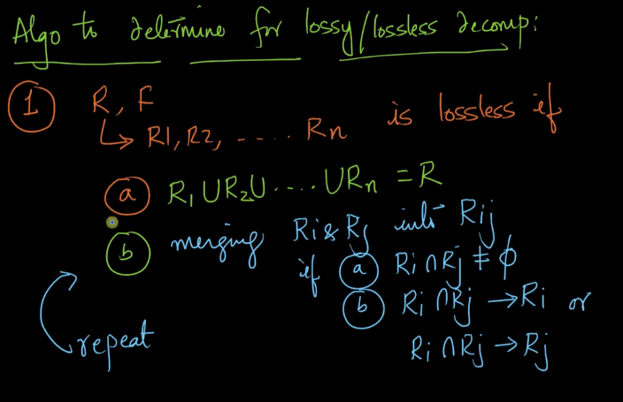
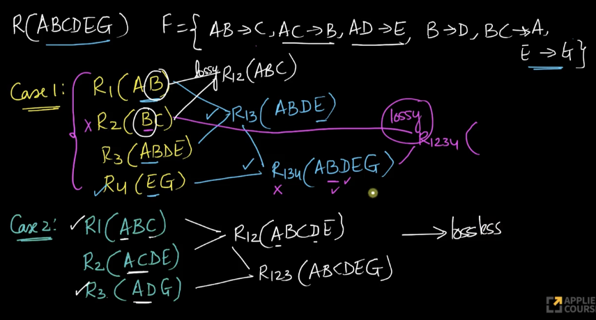
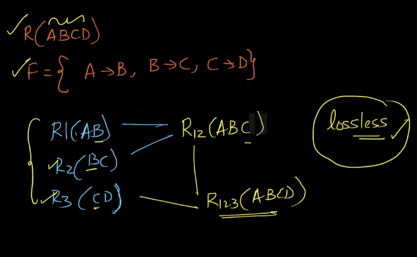

# 6. Decompositions with solved problems
Created Fri May 3, 2024 at 10:46 PM

Video: https://www.scaler.com/topics/course/dbms/video/514/
## What is decomposition
By decomposition we mean process of breaking down a given table in multiple tables.
This is done for various reasons, one of them is minimizing redundancy (save on storage space).

## Decomposition requirements
A decomposition operation needs to ensure the following 3 requirements:
1. No redundancy among the decomposed table.
2. Lossless decomp - there should be no data loss.
3. Dependency preserving - all FDs should be preserved.

## Redundancy anomalies - one reason to decompose a table
If a table has redundant information, the following 3 anomalies are possible:
1. Update anomaly - multiple rows may need to be updated
2. Insertion anomaly - when a new record is added, it may have NULL values for other attributes. This wastes space, as NULL also takes some space.
3. Deletion anomalies - when a record is deleted, all it's duplicate instances need to be filled with NULL values.

Example:

- 8m15s redundancy example screenshot
- 14.0 3 kinds of anomalies that happ if there's redundant data. Screenshot
- 14.30 starts detailing the 3 requirements for decomposition

## Precise definition of decomposition requirements
- 16:40 uses FD for the first time in real example. And also tells that decomposition anomalies are different from FK constraints.
### 1. Eliminate redundancy by breaking into multiple tables
  

### 2. Lossless decomposition (aka lossless-join-decomposition)
If the natural join of all sub-relations equals the original table, then the decomposition is said to be lossless. Otherwise it is lossy (lossy could mean extra, less or different data).

This works because this (requirement 2) is separate from requirements 3 (i.e. FD preservation)

An important point - decomposing on non-key attributes as common column leads to lossy decomposition. The core problem here (i.e. using non key attributes) is that non-key attribute can have duplicates that cause extra rows in join output (supposedly the single table). 
*So decomposition must happen based on key columns*.

## Check if decomposition is lossless - common attribute key nature is known
note: Pairwise any table's SK, not both/all's SK.

Q: Shouldn't the condition be SK in both/all tables?
A: No. Actually having atleast one suffices. Example: suppose there are two tables and one has a attribute that's a key in it, and the other table has duplicate values for those. When you do a natural join (lossless criteria), the total number of rows remain the same (i.e. one side unique was enough).

Of course, if there are more than 2 tables, then the condition of SK has to old pairwise. Since after first two tables, the same key attribute (of one of the tables) cannot be used, since second table has duplicates, and pairwise join (of 1 and 2) also might have duplicates.
## Check if decomposition is lossless - common attribute key nature is not known
*Here input is a table, FD-set, and decomposed tables.*

If we knew the nature of common keys, deciding lossless is trivial (see above section). But we don't know about the nature (key or non-key).

It is quite easy to check the key nature though, using the fact for a key "attribute closure would equal all attributes". We have already seen this in [3-Attribute-Closure-Keys-and-Solved-problems](3-Attribute-Closure-Keys-and-Solved-problems.md).

Algorithm:
1. First check if all attributes are present in subrelations (union of attributes). If this does not hold, the decomposition is obviously lossy.
2. Now, consider tables pairwise (have to be smart in choosing here), where each pair has a common attribute(s - multiple common are OK).
3. For each, check if common attribute is a SK or not - compute attribute closure for the common column, w.r.t the FD-set.
4. If yes, then the pair is decomposed lossless, convert the pair into one table (consider), and continue with algorithm with the remaining sub-relations (including the considered one).
5. If we can have a final table. then the decomposition is lossless. But if at any time, neither have a SK, then its lossy.

- 30.30, gives lossless decomposition method based on FD, kind of a method
- 37.20 talks about writing an algorithm that determines if a given decomposition is lossy or not.

Example 1: 
Example 2:
