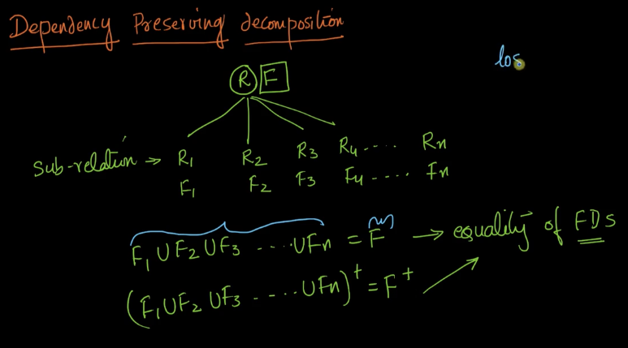
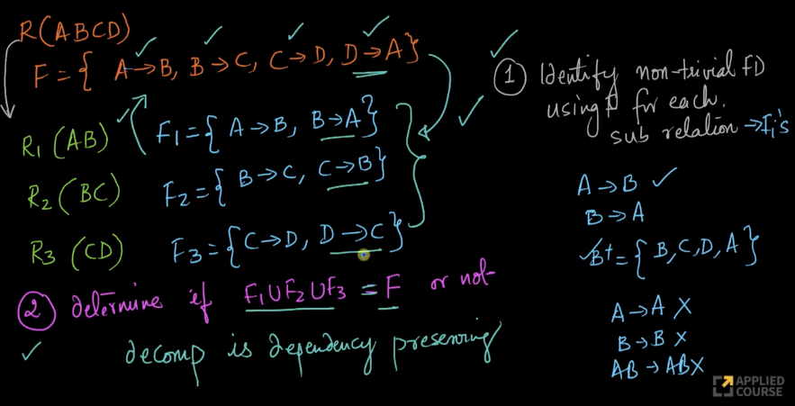
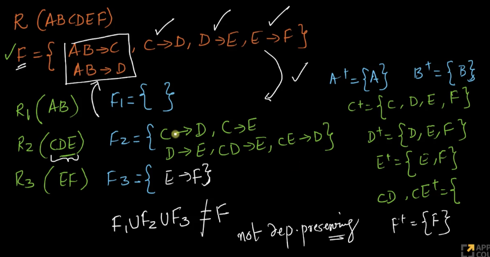
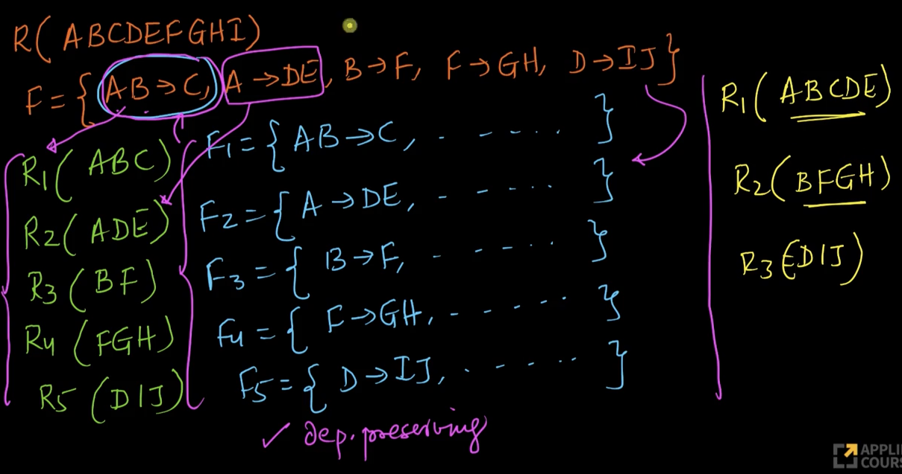

# 7. Dependency preserving decompositionsolved examples
Created Fri May 3, 2024 at 9:34 AM

Video: https://www.scaler.com/topics/course/dbms/video/515/

## Precise definition of dependency-preservation
Video 2 min mark. The equality here is based on FD-set equivalence (which means computed attribute closures are equal).

## Method - Checking if given decomposition is dependency-preserving
*Input here is a single table (one large column set), it's FD-set, and other tables (column sets). FD set for the sub-relations (aka decomposed tables) will not be given (and is not needed).*

1. Compute FD-sets for each sub-relation, i.e. identify all non-trivial FDs (i.e. identical LHS RHS can be skipped) using F for each sub-relation. *The usual variate is all columns and both-directions*.
2. Determine if FD-set union of sub-relations equals (i.e. closure equals not set equality) original FD-set.

Example 1: 

Example 2: 

Example 3:

Example 4 (early determine)
Look: we didn't need to find all non-trivial FDs, since the union with just 1 term for each sub-relation was enough.

Q: what about extras
A: even though first term of each was enough, we used up all FDs, so any subsequent FD in any sub-relation would be a derived one, hence we're done.
