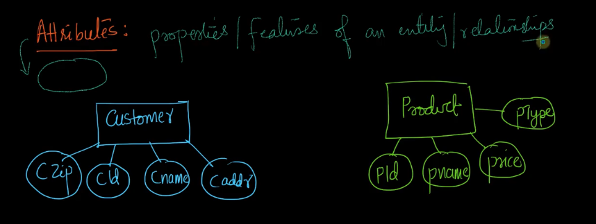
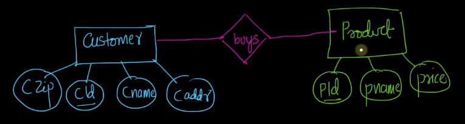
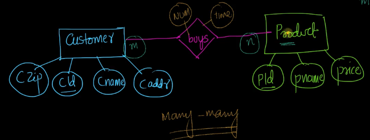
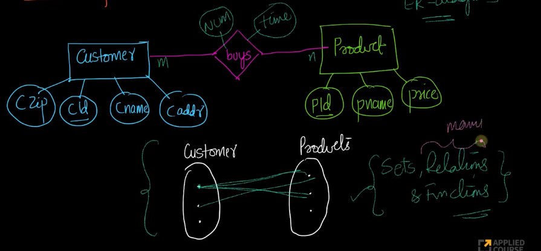
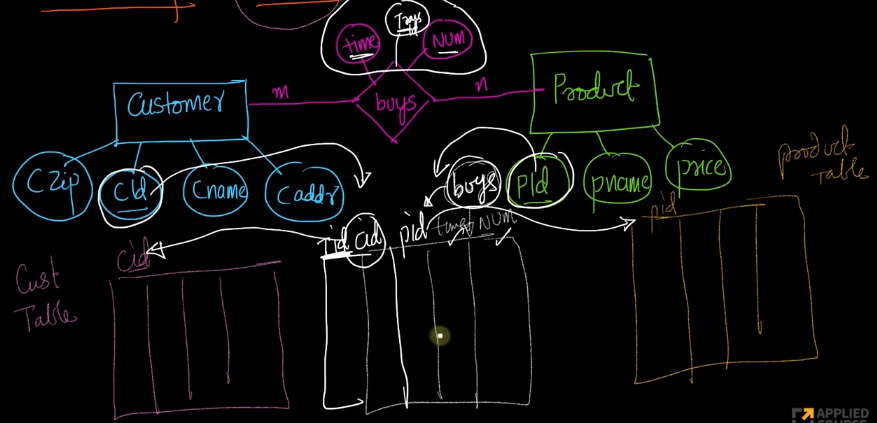
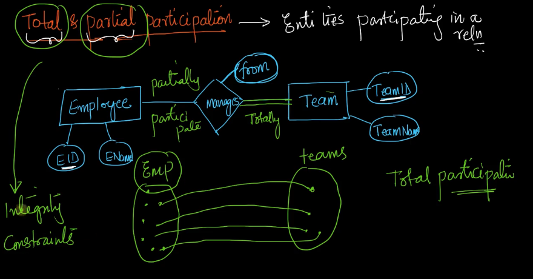

# 1-Introduction-to-ER-diagrams. 
Created Tue Mar 26, 2024 at 9:49 PM

Video: https://www.scaler.com/topics/course/dbms/video/464/

- aka ER models or ER diagrams

## Purpose of ER diagrams
The purpose of ER diagram is to represent a high level picture of the database in its *entirety*. It is an exhaustive diagram document.

By database here, we mean tables, keys and integrity constraints of the database.

It is usually a document a new person who wishes to understand the database can refer to and read.

ER diagrams give a logical view of everything that exists or that we wish to capture in the database.

## What are entities
Entities in ER diagrams are objects. Objects can be physical or even logical.
- Textbook definition - an object that can be uniquely identified. Example: customer, product in Amazon database are objects.
- An entity is represented using a rectangle.

## What are attributes
Attributes - the features (aka properties) of an entity, or of a relation. Attributes of an entity or relation can be thought of as attributes/columns of a table (the table may be of the entity or the relation, yes, relations between objects can have their own table).

So, entities will finally be tables, and attributes will be the columns of the tables.

In natural terms, attribute are *nouns*.
### Types of attributes
1. simple attribute - *represented using a ellipse.*
2. Key attributes - i.e. attributes that are keys of the entity's corresponding table. *Represented using a circle with label underlined.*
3. Multi-valued attributes - i.e. an attribute that has multiple values of the same type (i.e. value of the attribute is an array if entity is represented as JS object). Example: Customer entity's credit_card_id and phone_number attributes, since a customer may have multiple credit cards and phone numbers. *Represented by double ellipses.*
4. Derived attributes - an attribute that can be derived/computed using existing concrete attribute(s). *Represented using a dotted ellipse*. Example: age is a derived attribute assuming DOB concrete attribute exists. The compute to derive should be deterministic and O(1)? (CHECK)
5. Compound attribute - an attribute could be broken down into multiple attributes. Such a divisible attribute is a compound attribute. Example: fullName is a compound attribute that can be broken into first, middle and last name. Another example is address, which can be broken into street, city, state, country attributes. *Compound attribute is represented automatically by showing branches coming out of the attribute where each child is a simple attribute*

## What are relations
Represented by a diamond shape that connects two or more entities.
So a relation is a way to connect multiple entities.

Naturally speaking, a relation is a *verb*. Verb because there is some interaction/relation-colloquial between the objects.

- A relation can have attributes. For example "buys" relation between customer and product can have the buying_time attribute.
- Relations can be one to one or even many-to-many. Example a customer can buy multiple products, and a given product (i.e. copies of) can be bought by many customers, so it's a many-many relation.

## Set-theoretic notation
In addition to ER notation, an equivalent set notation exists for visualizing entities and relations and can be quite helpful when designing or analyzing ER diagrams.

It is especially helpful in relations - one-one, many-many relations.

It is also true that relations in database are exactly the same as the relations concepts in math, including one-one, many-many concepts of relations and functions.

## Table notation
ER diagrams can be visualized using a table notation too.

To connect two entities, one can create a middle table (the relation table) which will have FK of the two entities, as well as columns for the relation's attributes. Of course, a PK is also present.

This is one way to translate ER diagrams to tables, but not the only way. The transformation is important since at the end of the day, a database is about tables and not ER diagrams.

## Total and partial participation
We are talking about entities participating in a relation.

Total participation means every instance of a given entity participates in the relation. Visualizing in set notation, each element of the set is participating in the relation. In other words, the pre-image (depending on which direction the diagram is) always exists. The set playing pre-image is the one "totally" participating.

OTH, partial participation means that for a given entity, not every of its instance , or element (set notation) participates in the relation.

Example: employee and teams entity with "manages" relation.

Total is represented by double lines.
Partial participation represented with a single line.

Total/partial participation can be seen as user-defined integrity constraints.