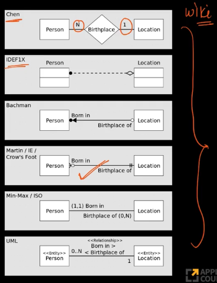
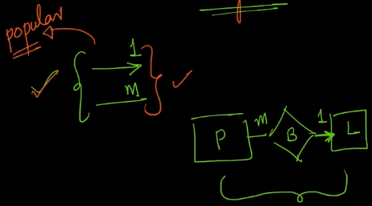
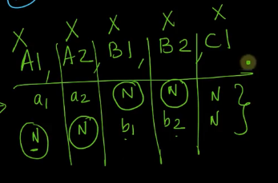

# 2-Cardinality-of-relationships-and-constructing-minimal-tables. 
Created Tue Mar 26, 2024 at 10:45 PM

## Cardinality
Number of elements in a set. In this course, it means number of instances of an entity.

## Cardinality of relations
There are 4 types of possible cardinalities of a relation:
1. one-one. Example: customer "has a" driver's license
2. one-many. Example: a mother "has" many children
3. many-one. Example: All children "have" a mother
4. many-many. Example: People "studied" in school

Note: 
- Non-participating elements are ignored.
- Direction does matter in cardinality of relations, in the sense that changing the types of arrows changes the meaning of the relation. Of course, reading in reverse, or mirror-reversing the diagram causes no change to the meaning.

TBH, this was covered in class 12th in sets and relations.

## Cardinality and participation
 Total or partial depends on participation, and definition of cardinality ignores non participating entity instances (elements). By ignoring, I mean a one-one (or any of the 3 other types) relation remains the same relation even if one more instances, even if on both side, stop participating in the relation.
 
 This makes the possibility space of \[total, partial] x \[1-1, 1-n, n-1, n-n] visible large.

We will explore nuances of these combinations later.

## Cardinality representation conventions
There are many. All are equivalent. Different people prefer different notation, no problem.

We'll use this:
- 1 side - line with 1 as label
- many side - line with variable as label
- Double lines means total, single line means partial participation

## ER2T - Constructing tables from ER diagrams*, using general algorithm and cardinality-participation value*
During transformation, we need to take care/consider 3 things:
- cardinality
- participation
- keys

The following are a exhaustive set of rules that help in constructing proper tables. how to use? Just try to create tables and also satisfy the rules at the same time. Eventually, rules get satisfied, stop there, you are done.

Steps:
1. Given an ER diagram, find its cardinality and participation values of entities, and then start transforming the diagram into tables.
2. Try to store *all* data in tables and make sure all criteria are satisfied.
3. Use set theoretic notation for rough work.

Satisfaction criteria:
1. Minimize \# of tables. *Initially try to do it all in one table, if not possible create more tables and check, and continue like so*.
2. Every table must have a primary key. It must be unqiue and not null. *Try to make attributes PK and see if they can be NULL or duplicated, if yes, consider another attribute for PK*.
3. Each cell must not multiple values (i.e. array). The value can be NULL too, fine. *Make a relation table or try to create extra columns (if it scales).*

note: 
- I already guessed point 3. Also point 2 makes sense and point 1 in general makes sense, i.e. we don't instantiate tables quickly, nor do we store arrays in a cell (column). Scaling should not be done using these approaches. WHY?
- Generally 3 tables all combinations given a relation between 2 entities, since the middle table also has a PK. The usual fight is of disproving 1 is enough, 2 isn't enough. The general max number is n + 1. The 1 is for the relation table.
- Don't worry about both side FK/PKs if the FK is unique (binary search is possible). one side is enough as long as the link exists and all data is captured.
- For personal naming, I'll name this algorithm ER2T
- An ER diagram attribute may have an array value (i.e. multiple values of same kind), but a table cannot. Notational difference.

## Constructing table example problems
- Lets try for one-one and partial-partial relation? Can it be done in one table?
	
	Not possible, see counter example below
	
Note: 
- many-many relations need 3 tables no matter the cardinality. In general many-many needs n + 1 (n entities are involved).