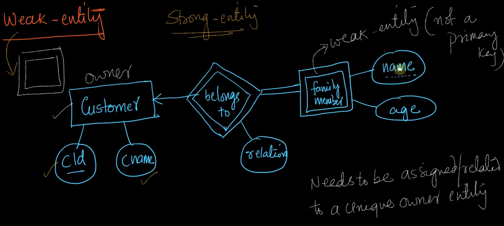
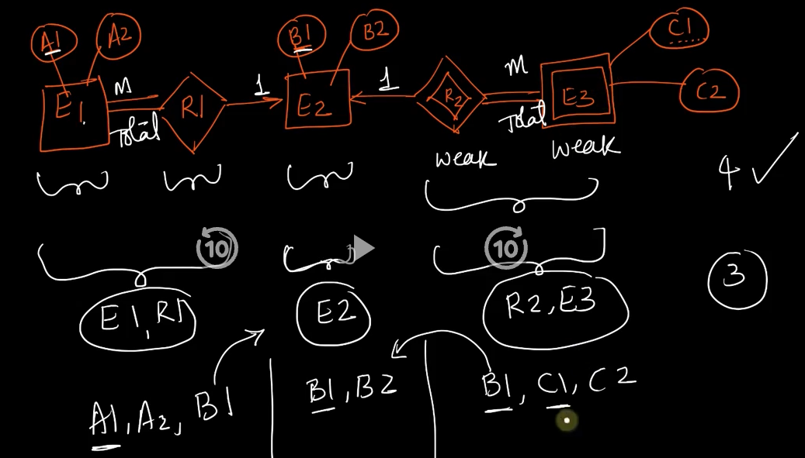
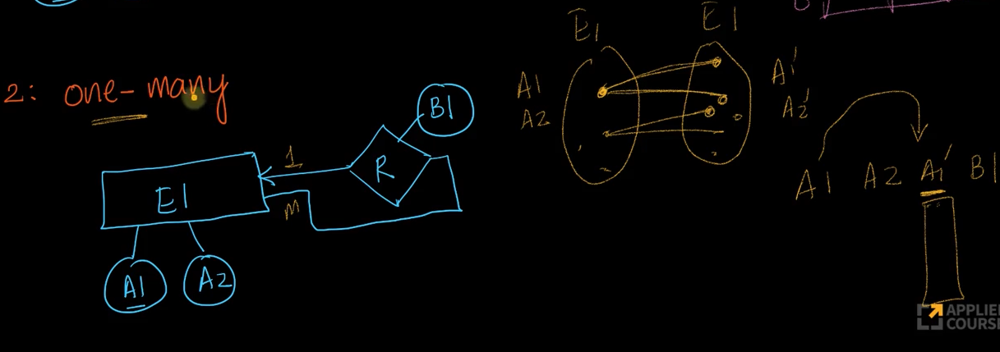

# 3-Weak-and-Strong-Entities-Self-referential-Relationships-and-Constructing-Tables. 
Created Sun Mar 31, 2024 at 7:37 PM

resume from video start https://www.scaler.com/topics/course/dbms/video/467/

## Weak entities
All examples until now were strong entities.

A weak entity is an entity whose existence depends on pre-existence of some other entities.

- A weak entity cannot exist on its own. It needs to have a unique and "owner" strong entity.
	- This also means a weak entity participates totally with the "owner" strong entity.
- Weak entities don't have a PK, but does have key attributes (i.e. attribute that has unique values)
	- Since all weak entities (even those having different owner strong entity) are usually stored in one table, a PK is needed, this PK is usually a compound key - the PK of the related strong entity and their own key.
- Weak entities are represented by double box.
- The ER2T algorithm stays the same even for ER diagrams having weak entities.

**Example**: Amazon has customers. And a customer can create "family accounts". In this example, the names of family members are assumed to be unique. But globally viewed, the `name` key is not a primary key (because it is not unique globally - i.e. two customers may have family members that happen to have same name).

- *Note about doubt:* the name could have been considered primary key, if we had a dedicated table per customer for their family accounts, i.e. number of family account tables === number of customers. But this violates the ER2T rule of having minimum number of tables. This means all family accounts of all customers would typically be saved in the same table. And if all accounts are in the same table, then `name` is not longer guaranteed to be unique. Cool. Furthermore, the PK of the family accounts table would be a compound key consisting of (customerId, name), which, would be unique.
- GUESS: weak entities can be used to model tree (i.e. parent and children) type of relation.
- When to have weak entities - if you observe strong and permanent dependence, then the entity can be modeled as a weak entity. See [this](https://softwareengineering.stackexchange.com/a/178507)

## Doing ER2T for weak entities
The general algorithm, i.e.ER2T remains the same. 

Note: 
- We can reuse existing table results (values for combinations of cardinality), to quickly answer what happens when a new block is attached to a relation, so we don't have to work it out from scratch.
- As can be seen here, *appending* a new block (E3) is simple to calculate, since it only interacts with the connecting block (E2 here).

## Self-referential relations
12:20
Example: Employee manages employee, or in other words, all employees have a manager. 

### One-one self relation

One table is enough.

Doubt:  
- > Srikant claims 1 table is enough. It is, but only if you are willing to repeat the same type of non-PK columns once. i.e. A2 and A2' are of the same type. Another qualm I have is that A2's data is stored redundantly.
  Ok, strictly speaking, ER2T does not care about column redundancy, so this is fine.
  
  The problem is I'm thinking of representing "manages" and "managed-by" (which is what we do to avoid array cell values) at the same time explicitly. But there's no need for it, information wise, because the information is captured just fine even if only "managed-by" is focused on. Because both are equivalent, because on leads to the other question. *This is fine performance wise too, since in any solution, we will have to traverse rows, unless we are fine with storing an array as cell value*. The non-participating or one side instances here will have NULL values. Size of table is n.

### One-many self relation 
1 table. See how: make set theoretic notation, then name columns A1, A2 and right side set columns A1' and A2'. So eventually, the many side becomes PK (although it's the same kind of attribute as). The non-participating rows can also be seen as being on the many side, but just not participating. And that's it, we're done.

note: ~~this too has the problem of redundant data for the many side rows.~~ doubt cleared above. This is correct.

### Many-many self relation
Make the set theoretic notation. 
Name columns A1, A2 and right side set columns A1' and A2'.

Try in one table, a left side node relates to two right side ones. So, A1 will get repeated, so cannot be PK. Now consider a right side node that relates to two left side ones, now A1' will repeat, so it cannot be PK either. We're stuck. Need to create extra table.

Try in two tables, lets reset our approach and do this: create a simple table enumerating all instances of the entity. Next, create another table having columns A1, A1'. Both can't be PK because both columns repeat, so we add a new column altogether and make it the PK. Done. The solution was simple - one table to enumerate all entity instances, and another table to enumerate all relations. That's it.

