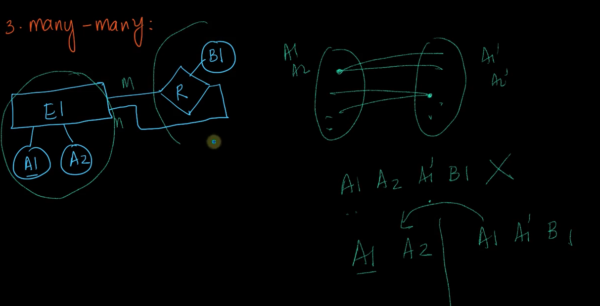

# 3-Weak-and-Strong-Entities-Self-referential-Relationships-and-Constructing-Tables. 
Created Sun Mar 31, 2024 at 7:37 PM

resume from video start https://www.scaler.com/topics/course/dbms/video/467/

## Weak entities
All examples until now were strong entities.

- A weak entity cannot exist on its own. It needs to have a unique and "owner" strong entity.
	- This also means a weak entity participates totally with the "owner" strong entity.
- Weak entities don't have a PK, but does have key attributes (i.e. attribute that has unique values)
- Weak entities are represented by double box.
- A weak relation is the relation between a weak entity and it's "owner" strong entity.
- The ER2T algorithm stays the same even for ER diagrams having weak entities.

**Example**: Amazon has customers. And customer can create "family accounts". In this example, the names of family members are assumed to be unique. But globally viewed, the `name` key is not a primary key (because it is not unique globally - i.e. two customers may have family members with the same name).

- *Note about doubt:* the name could have been considered primary key, if we had a dedicated table per customer for their family accounts, i.e. number of accounts table === number of customers. But this violates the ER2T rule of having minimum number of tables. This means all family accounts of all customers would typically be saved in the same table. And if all accounts are in the same table, then `name` is not longer guaranteed to be unique. Cool. Furthermore, the PK of the accounts table would be a compound key consisting of (customerId, name), which, would be unique.
- GUESS: weak entities can be used to model tree (i.e. parent and children) type of relation.

## Doing ER2T for weak entities
The general algorithm, i.e.ER2T remains the same.\ 

Note: 
- We can utilize existing table count values for combinations of cardinality, participation to quickly answer what a new attached block can do, don't need to do from scratch.
- As can be seen here, appending a new block (E3) is simple to calculate, since it only interacts with the connecting block (E2 here).

## Self-referential relations
12:20
Example: Employee manages employee, or in other words, all employees have a manager. 

### One-one self relation
Srikant claims 1 table is enough. It is, but only if you are willing to repeat the same type of non-PK columns once. i.e. A2 and A2' are of the same type. Another qualm I have is that A2's data is stored redundantly.

Ok, strictly speaking, ER2T does not care about column redundancy, so this is fine.
Ok 1 table.

### One-many self relation 
1 table. See how: make set theoretic notation, then name columns A1, A2 and right side set columns A1' and A2'. So eventually, the one side becomes PK. The non-participating rows can also be seen as being on the one side. And that's it, we're done.

note: this too has the problem of redundant data for the many side rows.

### Many-many self relation
Make the set theoretic notation. 
Name columns A1, A2 and right side set columns A1' and A2'.

Try in one table, a left side node relates to two right side ones. So, A1 will get repeated, so cannot be PK. Now consider a right side node that relates to two left side ones, now A1' will repeat, so it cannot be PK either. We're stuck. Need to create extra table.

Try in two tables, lets reset our approach and do this: create a simple table enumerating all instances of the entity. Next, create another table having columns A1, A1'. Both can't be PK because both columns repeat, so we add a new column altogether and make it the PK. Done. The solution was simple - one table to enumerate all entity instances, and another table to enumerate all relations. That's it.

