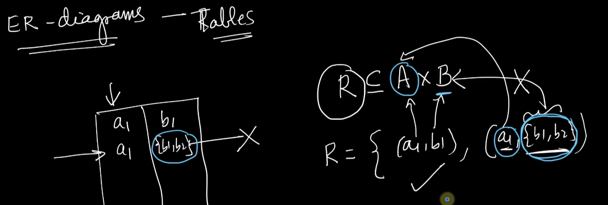
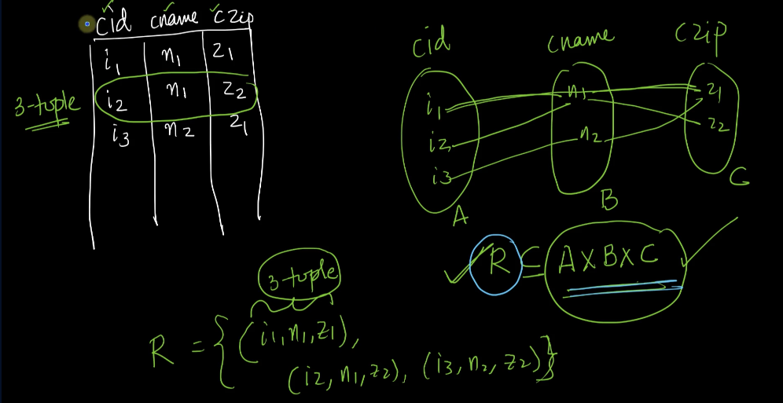

# 1-Mathematical-model-of-Tables. 
Created Wed Apr 3, 2024 at 1:10 AM

## Relational model and math
- A table is equivalent to a relation
- Each column of a table, has a domain.
- Relations between table means (relation between relation of simple sets). i.e. 2-sized logic chain, not one. So etymology wise, relational means tabular (i.e. consisting of tables) and not relations (between entities). Just a meaning thing.
- Important thing: all possible tables, however complicated, are a math-relation at the end.

## Relational model is strictly mathematical
The relational model is strictly tied to sets and relations, i.e. it should not violate basic structures of sets and relations.

Here are justifications for some rules we have silently followed until now:
- Rows cannot be duplicated: since a relation is also a set (a subset of cartesian-product), duplicates are not allowed.
- Multiple values cannot be saved in a cell: since a table is a relation, each cell should be an element of a simple (un-nested) set. Having multiple values would mean having a subset of the domain as value, i.e. having a set as value, which is not allowed.
  

## 3+ columns in the relational model work
A table is a relation, and a relation is a subset of cartesian-product of sets. Since cartesian-products don't have a max-2 bound, and can be done for 3 or more sets, a relation (aka table) can also be created easily.

## Relational schema
It's a concise way to represent a table. It consists of table name, columns and integrity constraints of the table.
