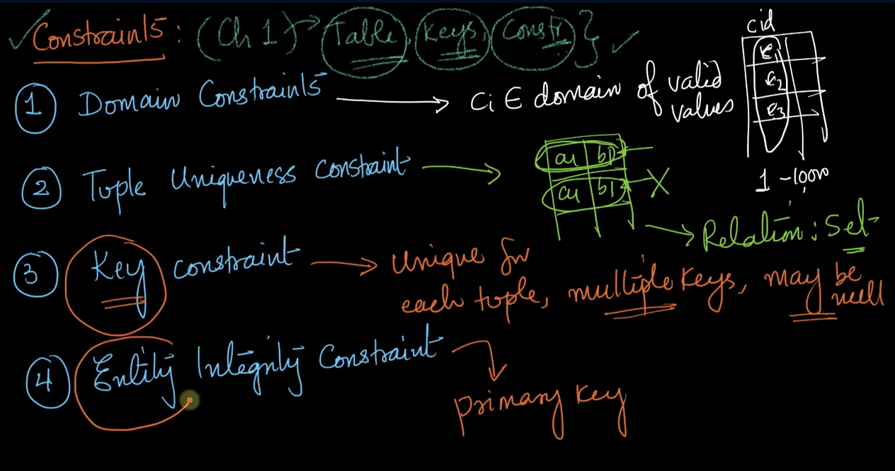

# 2-ER-Relational-Model-Constraints-and-Keys-recap. 
Created Wed Apr 3, 2024 at 1:54 AM

- Key vs entity integrity. Keys need to be unique, but can have NULL value. 
- Entity integrity - PK is a key, but with an additional constraint that it cannot be NULL.