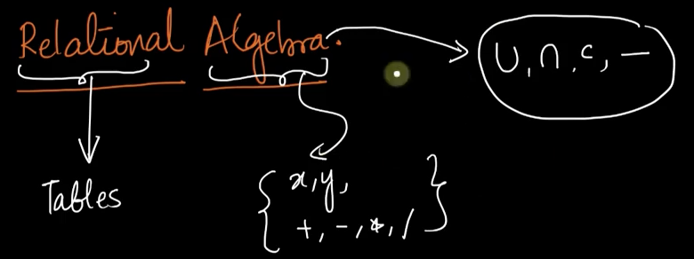
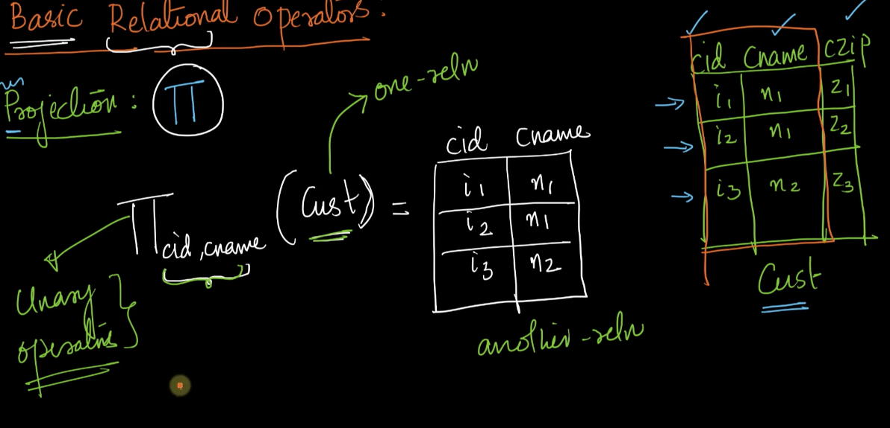
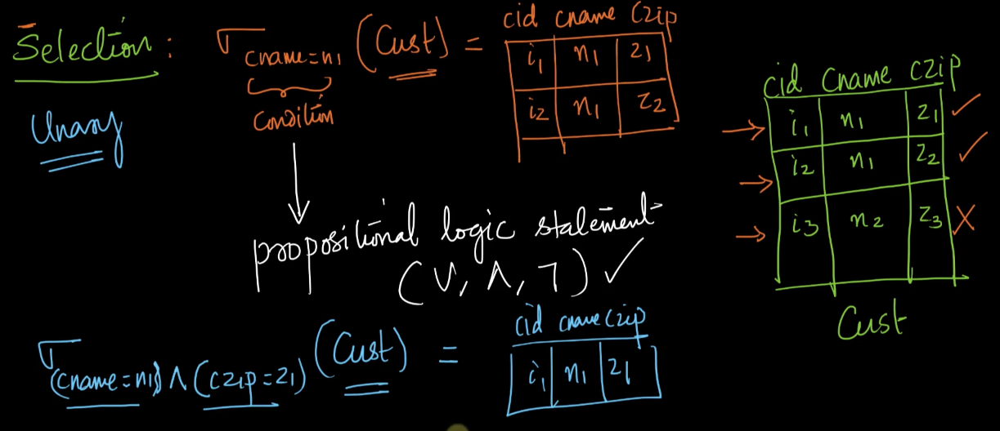
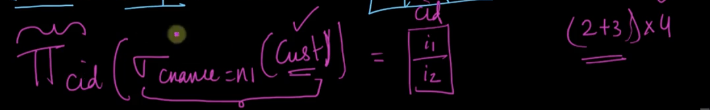
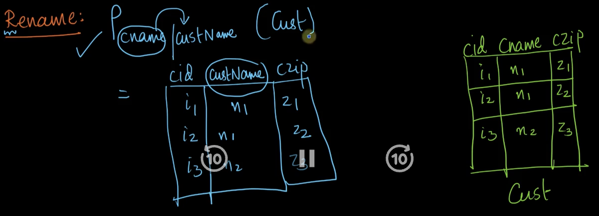
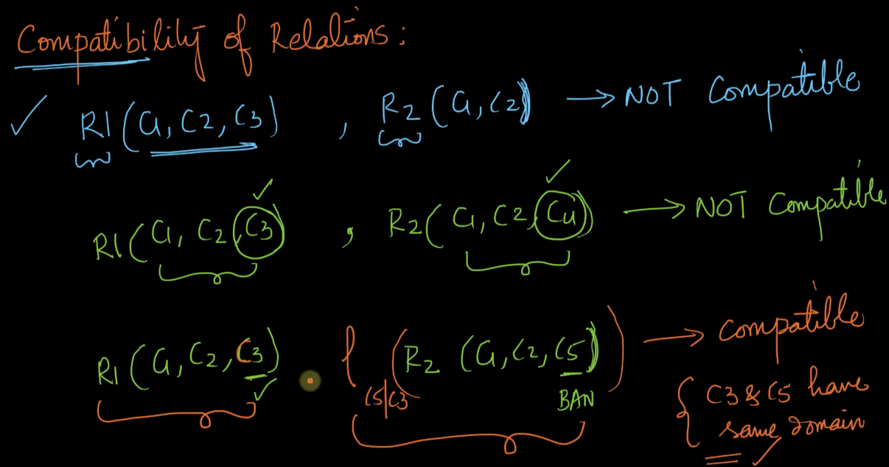
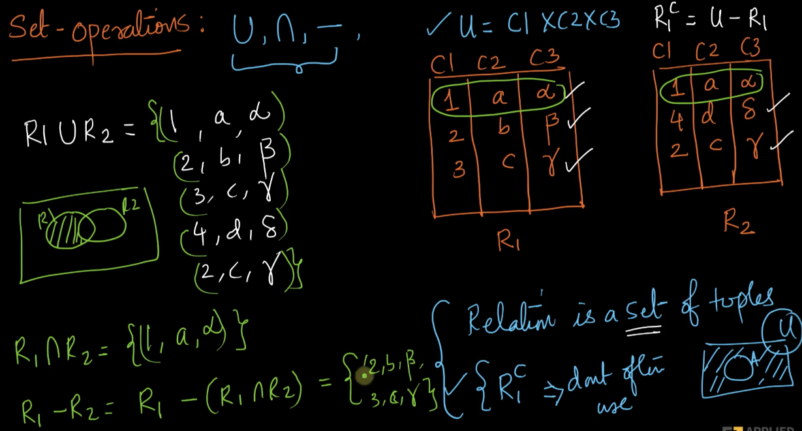
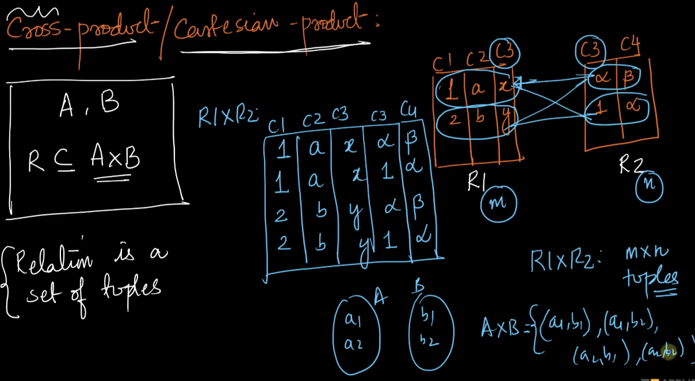
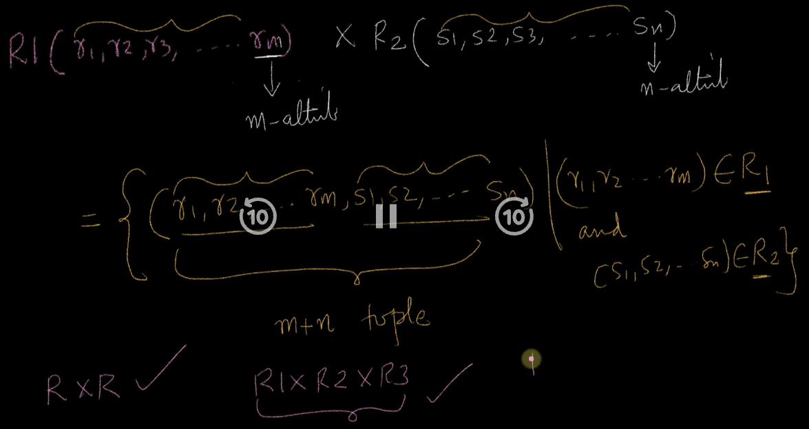
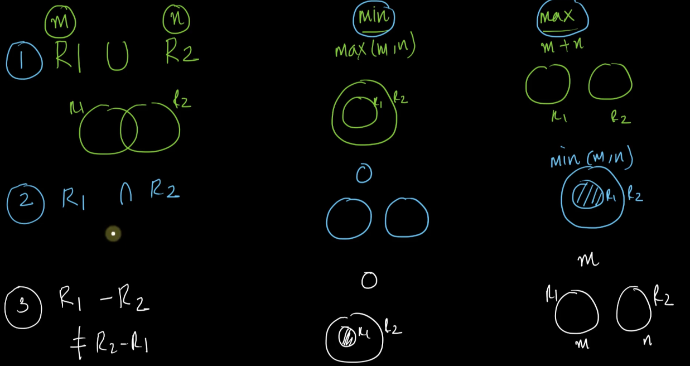

# 1. Introduction to Relational Algebra and Basic Operators
Created Wed Apr 3, 2024 at 11:26 PM

https://www.scaler.com/topics/course/dbms/video/471/

## Etymology
Relational algebra is a mathematical concept. 
It is built upon the concept of relations (tables).

In this algebra operands are tables, and we do some operations on them.
This is just like operators on sets and numbers, shown below.

This chapter is about understanding notation and some operations on relations (i.e. tables).

## Querying languages
We'll also learn about some "Querying languages". 

Query languages are tools to obtain data from DBMS.

Some of these are *like* programming languages while others are like a mathematical language. We'll learn about 3 querying languages:
- Relational algebra - based on set theory. It's a procedural language.
- Tuple relational calculus - based on proposition/predicate logic
- SQL - is *like* a programming language, used directly in the real world. It's an imperative language.

## Procedural vs Declarative languages
- Procedural - C/C++/Java. Here we provide very clear and minute instructions. aka *we code the what and the how*.
- Declarative language - SQL, React. Here we provide high level instructions, without details. The details are implemented in the language runtime. *we code the what but not the how*.

## Basic Relational operators
These operators are called like so because they operate on relations/tables.

1. Projection &Pi; - A unary operator that takes a relation (table) and a list (subset of attributes of the relation) as input, and outputs a relation containing only the attributes in the input list.
	- memory aid: Pi starts with P, Projection starts with P
	- Gotcha: if only one attribute is present in input list, and it's non-unique, then duplicate rows in the output will be discarded, i.e. final output cannot contain duplicate rows. This makes sense since a relation is a set, and so, duplicates are not allowed.
  
2. Selection &Sigma; - also a unary operator, it takes a relation and a condition as input, and outputs elements of the relation (i.e. rows of the table) that satisfy the input condition.
	  - memory aid: Sigma starts with S, Selection starts with S
	  - The conditional can be any propositional logic - AND, OR and NOT. But predicates, FOR-ALL, SOME are not allowed (CHECK?! about for-all and some). 
	  - The statements in the condition can use common relational operators like =, !=,  \>, \< and are usually between column values (this is usually used when operand is actually a cartesian product of two tables, i.e. R.c1 < S.c2 notation, of course, selection by itself is still unary).
	

	- Projection and Selection may be done in series. Like so:
	
3. Rename &Rho; - a unary operator that takes one relation (table) and two names (currentName and newName), as input, and output the same relation, but with the currentName attribute renamed to newName.
	- memory aid: Rho starts with R, Rename starts with R.
	- *"Why the heck do I need this" - Srikant asks, then says everything will fall into place when we start using complex/derived operators*.
	  
4. Set-operations: Union, Intersection, Complement, Difference.
	- Compatibilty criteria - set operations can only happen with relations (aka tables) of the same type. i.e. their attributes/schema is the same. All operations here assume relations are compatible. Criteria:
		- Attribute count is same
		- Attribute type (i.e. domain) is same
		- Attribute name is same. BTW, this can be fixed by renaming if only name is an incompatibility.
		  
	- Complement is not used much. Definition is simple: universe - given, i.e. `cartesianProduct - givenRelation`
	- Union: a table with all rows (of given relations) combined. Duplicates are not present as usual.
	- Intersection: a table with common rows.
	- Difference (A-B) - a table of rows that are only present in A.
	  
	  
	- Cartesian-product (an operator), i.e. A x B - a binary operator that takes relations as input, and outputs a relation with all attributes of the inputs (even if duplicate attributes, keep them) and all possible rows combination (of the existing rows of inputs). This is possible because relations are sets too. The input relations can be incompatible (i.e. have different attributes/schema)
		
		
		Clear definition (below)
		
	- Number of elements for set operations
		

Note:
- subset boolean check is not a propositional operator, since it involves a loop. CHECK!
	- So avoid using subset boolean checks in selection conditions, keep it strictly propositional