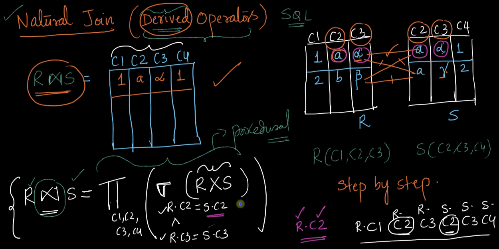
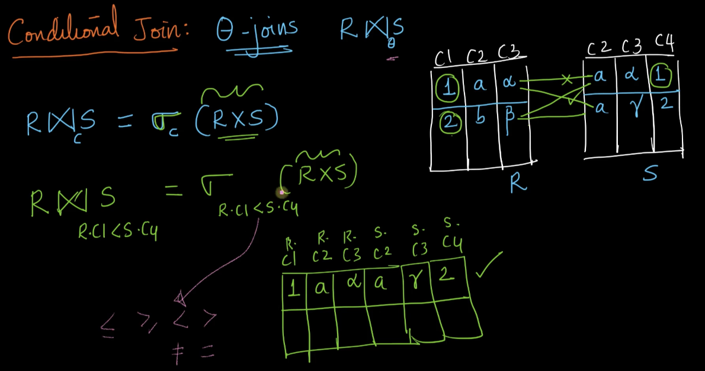
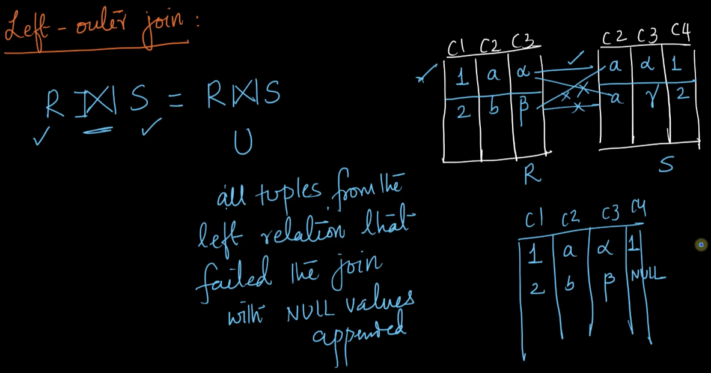
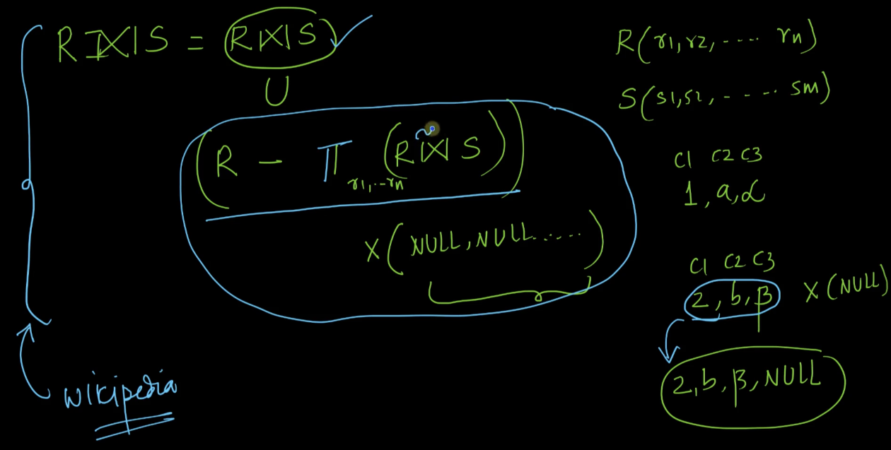
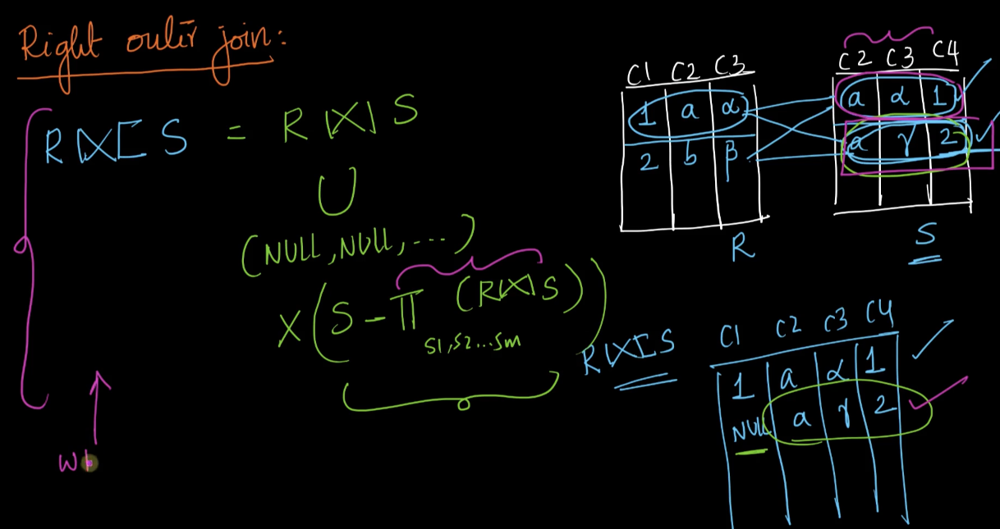
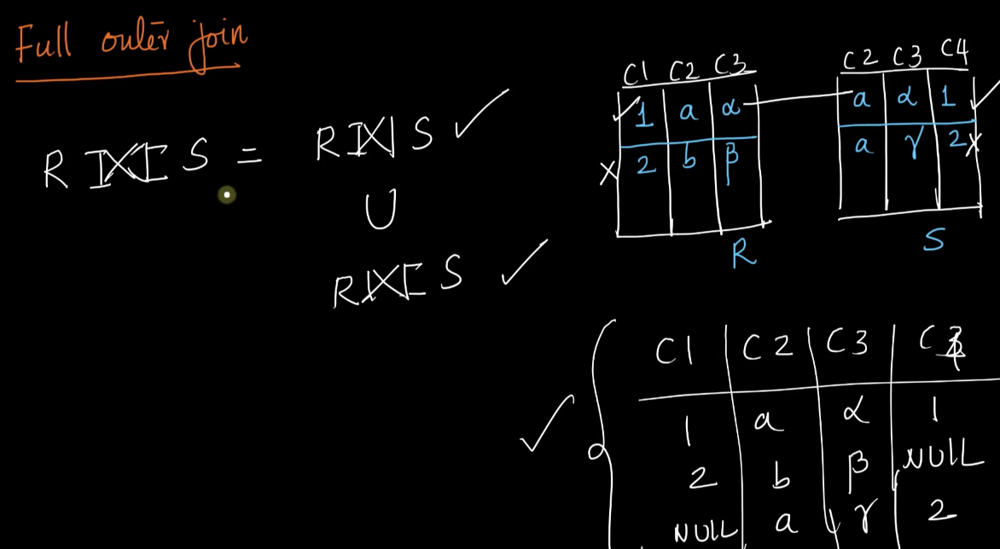
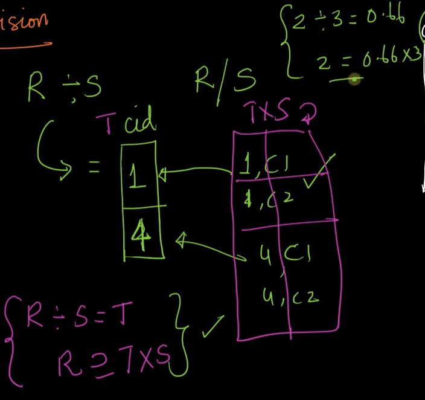
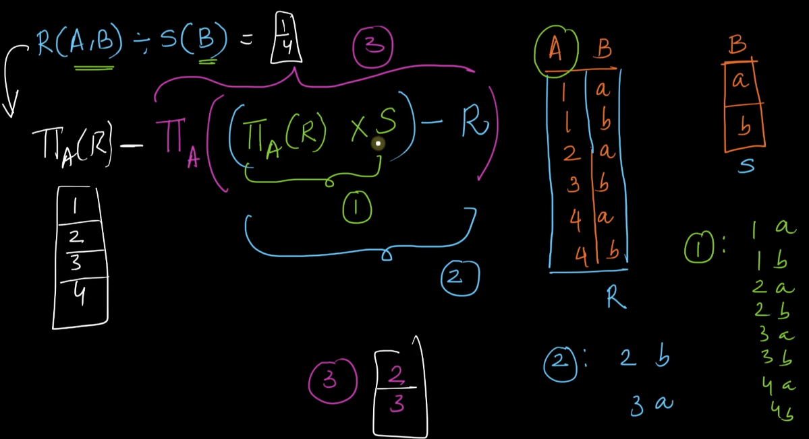

 # 2. Joins and Division Operators
Created Thu Apr 4, 2024 at 12:59 AM

## Derived operators
Some standard operators uses in database work.
All these operators are based on the basic relational algebra, and can be expressed using them.

## Joins (total 5)
### 1. Natural Join (A⋈B)
A binary operator that takes two relations as input, and outputs a relation which is the cartesian-product but include rows only if matching attributes are the same. Also, duplicate attributes also removed.

Here, lets consider all possibilities (i.e. cartesian products)
- R\[0] and S\[0] - matching attributes have same values, so add to output.
- R\[0] and S\[1] - matching attributes don't match, ignore.
- R\[1] and S\[0] - matching attributes don't match, ignore.
- R\[1] and S\[1] - matching attributes don't match, ignore.

At the bottom is the precise expression of "natural join" represented using basic relational operators.

### 2. Conditional join (A⋈cB)
aka &theta; join (A⋈&theta;B aka A⋈cB)

A binary operator that takes two relations and a condition as input, and outputs a relation which is the cartesian-product but with rows included only if they satisfy the condition. Attributes are kept appended as a cartesian-product usually does (i.e. duplicate attributes are kept).

### 3. Left-outer join (A⟕B)
A binary operator that takes two relations. Output is a relation with all rows from natural join but also includes rows of A that failed to join (didn't match with any row in B), with B attribute values set to NULL.

Here final attributes = attributes(A) union attributes(B), i.e. duplicates are ignored (they don't matter, since it's a compute on top of natural join).

It has a conditional version too, i.e. A⟕cB. The output here is same as left-outer join, but include rows only if they satisfy the condition.

Here is left-outer join expressed using basic operators.

### 4. Right-outer join (A⟖B)
Same as left outer join, but failed rows of B are included in the output, with A attributes set to NULL.

Or to be clear, a binary operator that takes two relations. Output is a relation with all rows from natural join but also includes rows of B that failed to join (didn't match with any row in A), with A attribute values set to NULL.

Here final attributes = attributes(A) union attributes (B), i.e. duplicates are ignored (they don't matter, since it's a compute on top of natural join).

Can have a conditional version, i.e. A⟖cB, where rows in the output are kept only if they satisfy a given condition.

### 5. Full-outer join (A⟗B)
Left outer join Union right outer join.

Or to be clear, a binary operator that takes two relations. Output is a relation with all rows from natural join but also includes rows from both A and B that failed to join (didn't match with any row in B and A, respectively), with B and A attribute values set to NULL, respectively for rows.

Here final attributes = attributes(A) union attributes (B), i.e. duplicates are ignored (they don't matter, since it's a compute on top of natural join).

## Division (A÷B aka A/B)
A binary operator that takes two relations a large-attributed relation A and a single attribute relation B.
And outputs a relation whose rows have the property that they were present in A such that all of the rows had same values for A's attributes and also had all possible values of the matching attribute as the rows of B, this happens for all kinds of rows in A.

Attribute, wise, the attribute of B are removed.

This may be difficult to state. Lets walk through the following example, here relation R has many rows. But only some rows (like ones with cid 1) have all values the same and also cover all values of relation B (in the attribute of B). cid 4 does it too, so the final output is the table with cid, and rows 1, 4.

Note:
-  If the larger table is 2-attributed, and smaller is 1-attributed, then the definition of "division" in this case becomes very simple to state: "rows from one relation that are related to all values in another relation, with matching attribute, and then duplicates removed".
### Division property, of reverse operation on other side
A constraint that is analogous to arithmetic exists for the division operator.
The constraint is that if R/S is T, then R is a subset of T x S (cartesian product).

This can be verified and proven, as shown below. 

Proof: It holds true because a cartesian product holds all possible values, but we're only looking for values who represent all values of S. And since we filtered from R, it has to be a subset (smaller) than the cartesian product.

### Division operator from basic relational operators
A little involved but fine.

note: I wrote this using almost predicate (i.e. filter row in subset) logic. But that was not required, the above is strictly propositional (i.e. even the conditional of selection is not needed, let alone subset operator).
## Complete set of operators
A complete set of operators are a set of operators that can represent any relational operators in that language.

The ones in relational algebra are - union, difference, cartesian-product, projection and selection.

i.e. this is the minimum set of relational algebra operators. e.g. intersection is not here, because it can be represented using union and difference (A intersect B = A U B - (A - B) - (B-A)).

## Feedback
CHECK!
- I got these operators. But what is their essence as summed in one word. What are they used for, naturally speaking when given a problem, i.e. when do you get a hint of what to use.
	- **Joins** does make some sense, in that it combines relations (aka tables). i.e. tries to see all sensible combinations of the rows. By sensible I mean if the two rows common attributes have the same value. It may be used for "exploration" or "analysis" purposes. Can also be termed as 'OR' boolean operation for rows, since OR leads to combinatorial explosion. With sensibility of course.
	- **Division** seems like a "reduce" operation, where we are getting a "report" back on which rows satisfy some sort of link to "all possible values" of a single attributed table. For reporting purposes.