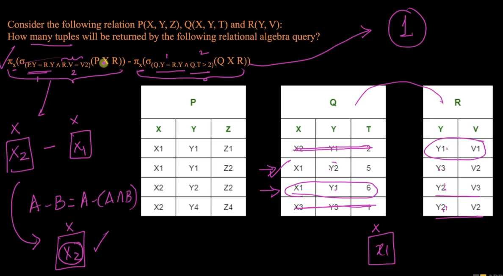
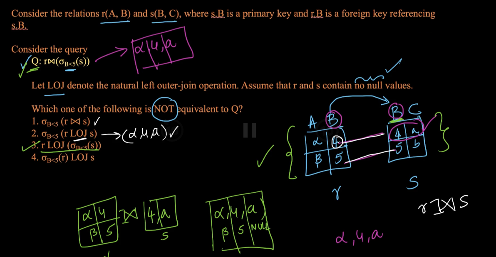
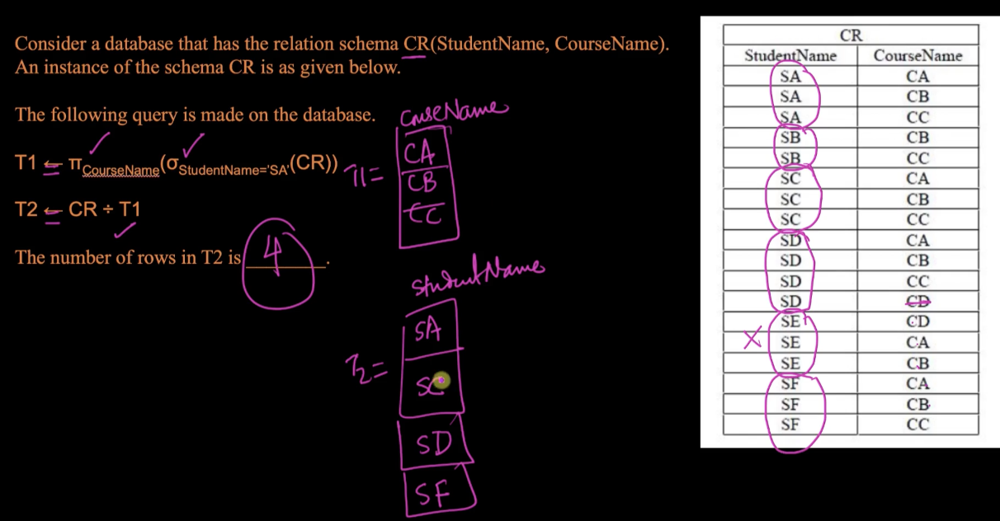
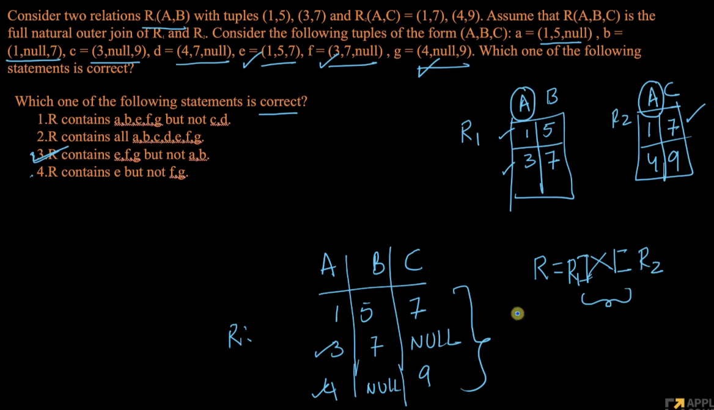
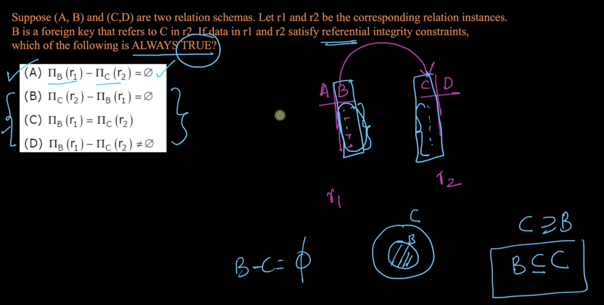

# 3. Solved Problems Relational Algebra
Created Fri Apr 5, 2024 at 12:51 AM

Resume from https://www.scaler.com/topics/course/dbms/video/473/

1. Just evaluate the expression. Only imp thing is being careful. 
2. No need to do decompose in fundamentals etc. Since it's asking NOT equivalent, so check which one may have missing or extra rows (only possibilities for non equivalence here). Answer is 3 since it has extra rows from r.  
3. Simple evalutation 
4. Simple evaluation. Find out the first value, i.e. R. Then pick out wrong options. 
5. It's a simple fact that foreign keys are a subset of the source table. So (dependent - source) is empty. 