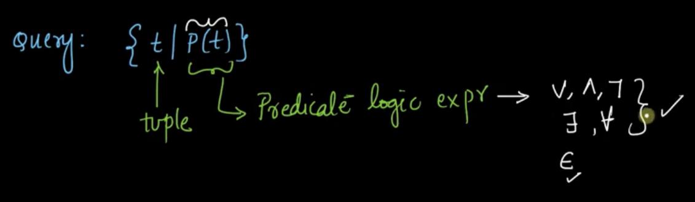
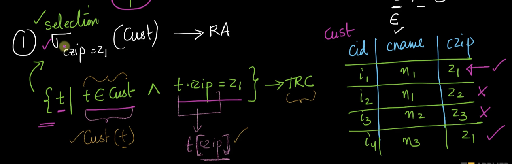

# 1. Tuple Relational Calculus I
Created Fri Apr 5, 2024 at 1:32 AM

### Comparison with other languages
We have discussed about 3 querying languages:
1. Relational algebra - Operators selection, projection, rename, set-difference, cartesian-product, natural-joins. It's a procedural.
2. Tuple relational calculus (TRC). It's declarative.
3. SQL - It's declarative

## Edgar Codd and math foundation of SQL
Edgar Codd was a mathematician and computer-scientist who made all these languages, and also many theoretical constructs in relational databases at IBM research in the 1970s-80s. He came up with mathematical foundations for his work, giving us reliable constructs to work with data.

TRC is the mathematical foundation of SQL

## TRC's logics
TRC is heavily based on propositional and predicate logic.

See the different kind of logics:

## A Query in TRC
A query in TRC is expressed/returned as set (see below), where `t` represents a tuple (i.e. row) and `P(t)` is a predicate logic expression.

The condition part contains operators from first-order-logic, viz AND, OR, NOT, there-exists, for-all, element-of.

continue from https://www.scaler.com/topics/course/dbms/video/474/ (6:46)
DRC?

## Examples of TRC queries
1. Selection in relational algebra as TRC 
2. Projection in relational algebra as TRC - the main point here is that there is no intuitive way to get only one attribute, instead of whole rows. But it's a valid operation.
   - The first (green one) is the classical way. The explanation here is that since the nested statement uses only t.id and not t, it must return (output) only the id attribute.
   - The second is the modern way. No explanation needed, it is intuitive if not completely explicit.
    
3.  Projection (multiple attributes) in relational algebra as TRC
    - First (green one) expression follows the classic logic again. Since nested expression uses only specific values of t, the output of the nested expression is just those specific attributes.
	- Second one is the modern notation. Just comma separated values.
    
4. combination example - the expression is simple, i.e. we're utilizing the fact that specific attributes of t inside nested expression (an expression of s) returns rows with only those (specific) attributes.
   
5. Cross product - First we need all combinations, and also need to extract all columns. We have two variables t1 and t2 for combinations part, but they are not t, so the query will return nothing. To get something, we need to read/write to t, that we do by using t in the nested query with specific attributes. As usual, in the above examples too, we get these back. Simple. 
   
6. Union - assuming both relations are compatible, this is simple, get all tuples if they are in R OR S, and since in TRC the result is a set, duplicates will be ignored.
   
   Set difference - this is also easy, but a little tricky, so we want to write conditions on t, but don't want false conditions to be returned ..., so use a local variable for checking. This is needed since anything t interacts with (i.e. belongs to here) gets returned. Alternatively, "not belongs to" is also fine. But the previous is a little more clear.
   
7. Difference - see above
8. Projection-Selection combination with a condition. The important part - here the condition is on a relation (bought), and since want all satisfiers, it's like a cartesian-product (or join, anything). So in TRC, consider all possibilities, and filter out where cid matches. The simple part - we need to find only CustId, so projection, in TRC, just use that inside the nested attribute on t, and only that will be returned.
   

## Formulae/eqns in predicate logic

Note:
- The notation ∀x P(x) is shorthand for P(x1) ^ P(x2) ^ P(x3). It is just an expression, i.e. A sentence ∀𝑥𝑃(𝑥) is true if and only if 𝑃(𝑥) is true no matter what value (from the universe of discourse) is substituted for 𝑥. Same goes for ∃𝑥𝑃(𝑥), but it is a chain of OR.
- 