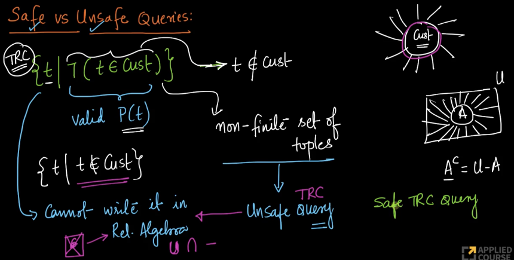
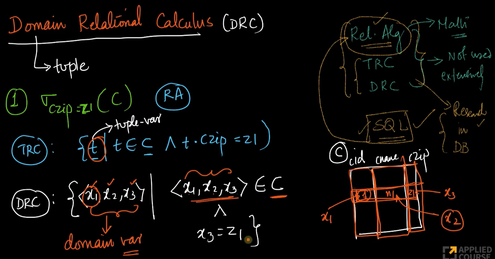
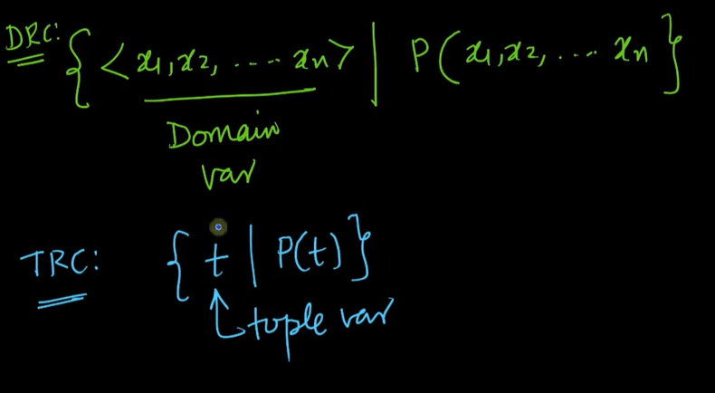
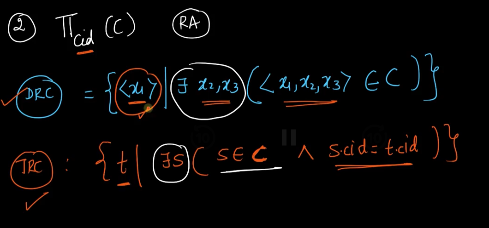
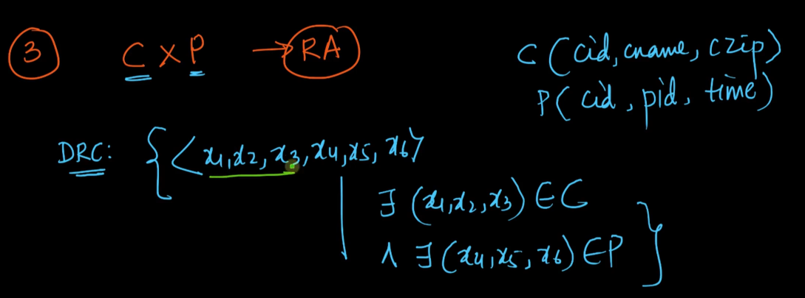

# 2. Safe queries Domain Relational Calculus
Created Sun Apr 7, 2024 at 8:24 PM

## Unsafe queries
Consider the green text below, it means "all tuples not in the customer relation". This was weakly defined and obviously detected in relational algebra (since we couldn't define the universal set and were required to define it, given RA is procedural).

But here, in TRC, it is difficult to detect, since the predicate expression is a valid predicate expression and also that TRC is declarative (i.e. such a query has to be allowed, since we have lifted the burden of exact specification from the user). Since the answer is not clearly defined. This is termed an "unsafe" tuple relational query.

## Expressive power of safe TRC and RA
TRC is has more expressive power than RA (Relational Algebra) since it can represent unsafe queries too.

Another fact is that all safe TRC queries can be expressed as an RA query (and vice-versa), consequently expressive power of RA is the same as safe TRC.

## Trick to check if TRC query is unsafe
- When you see complement of a free variable (i.e. variable not bound with a for-all, there-exists)

## Domain Relational Calculus
DRC is a (really?) just a syntactical form of TRC, where the main variable is not "tuple" but variables corresponding to the column (i.e. domain values).

### Selection in DRC
Here is the same query represented in RA, TRC and DRC. It's a selection query (the whole rows are returned).

### Definition of DRC
Just to be clear, a DRC is a query which takes as input a predicate logic expression specified w.r.t domain variables, and returns a set (of tuples).

### Projection query in DRC
To do projection, just use the required variable on the left side:

### Cross-product in DRC
Example of cross product:

### Practical use of RA, TRC, DRC, SQL
Practically speaking, none of RA, TRC or DRC are used practically. Only SQL is used.
Srikant has used RA once or twice, that too only for optimizing some SQL performance.

It is useful for research purposes however.

Personally speaking, I think knowing these internal 3 languages is important since it makes SQL predictable, you know the bounds and limits of what/what-cannot happen.