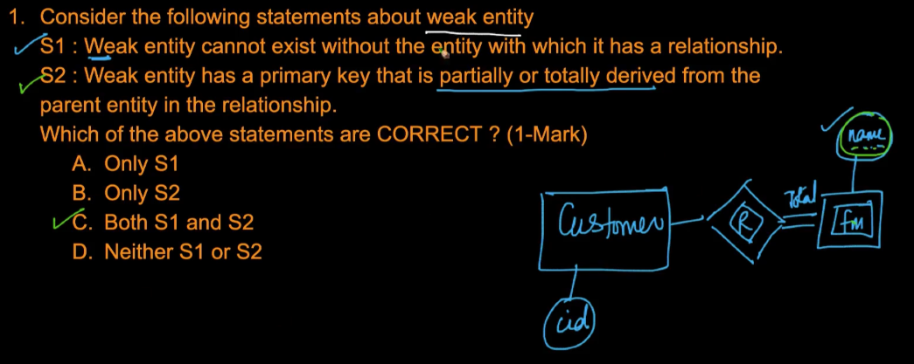
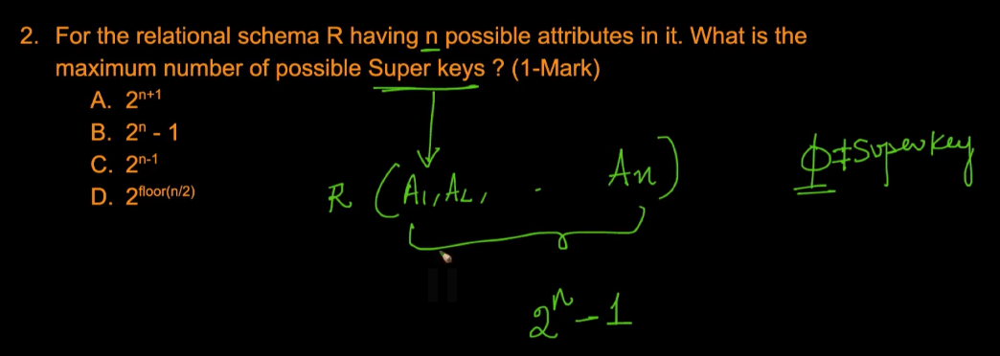
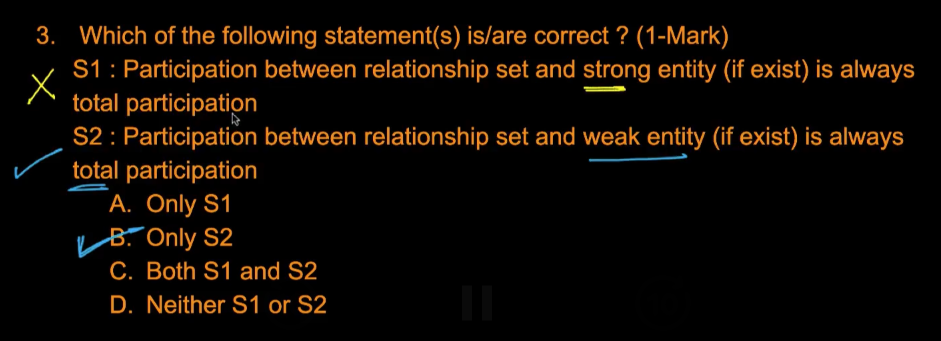
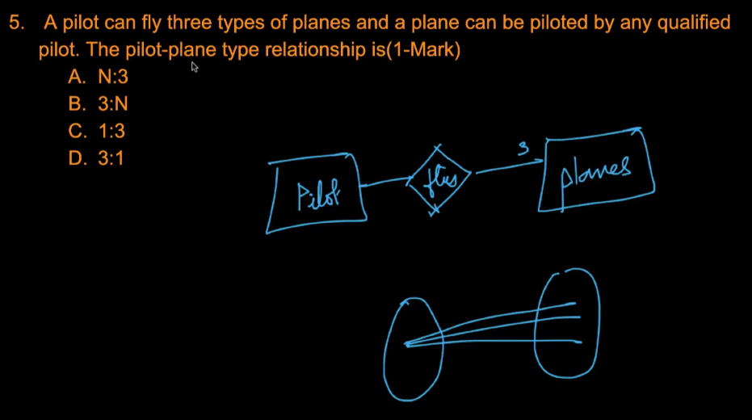
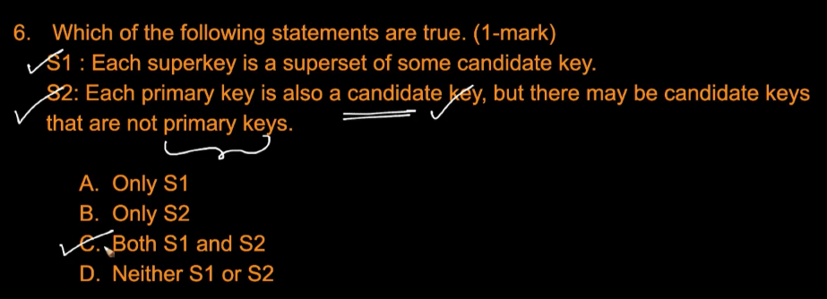

# 3. Solutions 1
Created Mon Apr 8, 2024 at 12:21 AM

Both follow from definition of a weak entity.

---

All attributes are keys, and -1 for the empty set, which cannot be a super key.

---

Follows from definition of a weak entity.

---

- Learnt something here. Just try to complete the sentences and the number is near the end of the sentence. e.g. Pilot -> flies -> 3 -> planes.

---

S1 follows from definition.
S2 is true since PK are decided arbitrarily.