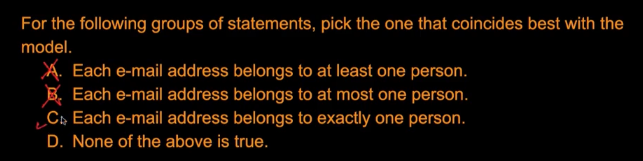

# 3. Solutions 1
Created Mon Apr 8, 2024 at 12:21 AM

Both follow from definition of a weak entity.

---

All attributes are keys, and -1 for the empty set, which cannot be a super key.

---

Follows from definition of a weak entity.

---

- Learnt something here. Just try to complete the sentences and the number is near the end of the sentence. e.g. Pilot -> flies -> 3 -> planes.

---

S1 follows from definition.
S2 is true since PK are decided arbitrarily.

---

Makes sense. But why would you have a 1-1 weak entity, why just make it an attribute?

---

- Team plays team self-referential m-n relation. Ok
- Every play has one referee. Ok

This answers the question, only B is correct.

But, how would you relate referee and team, and is the question even valid? Need help here. How would you read the diagram here. Ok, the problem I'm having is that here, due to a self-referential relation, there are two "reading paths" to move after moving from Referee to Plays. *This is a unique situation and happens only for self-referential relations*. Ok, given it's unique, I'll go a level deeper and make the tables for the ER diagram, which will be:
1. Teams table -  teamId, ...
2. Plays table - playId, teamId1, teamId2, refereeId
3. Referees table

This is consistent with ER2T (since self-relation is many-many).
Now, if you try to connect a team row to a referee (obviously via 'Plays'), and also make sure you consider all possibilities (but stay within constraints) you see it's a m-n relation.

So it's settled. Just remember, when you can't read an ER diagram simply, make a table. Since ER diagrams are complete but not always trivial enough to directly talk between entities. They represent only the minimum details, so as to leave gap for possibilities to occur. Have asked on [StackOverflow](https://stackoverflow.com/questions/78289414/do-er-diagrams-help-directly-answer-any-relationship-question)

---

1. UNIQUE can be null. Like a key (i.e. unique but not a PK)
2. NOT NULL - by definition
3. FOREIGN KEY - can be null, no problems. Non participating row, for example.
4. PRIMARY KEY - cannot be null, by definition
5. CHECK - will see later.