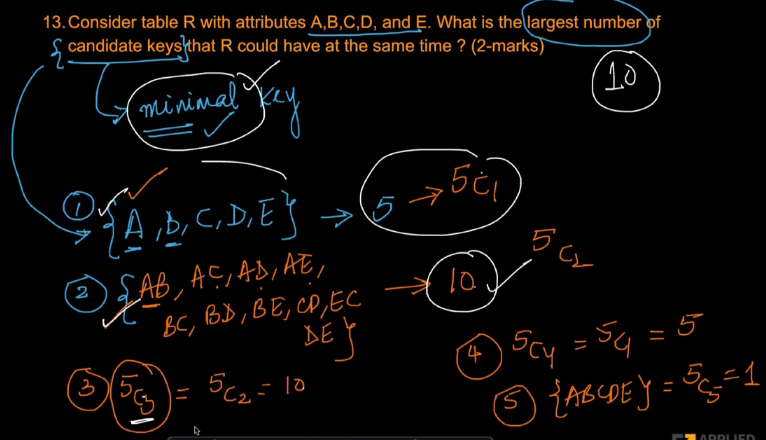

# 4. Solutions 2
Created Mon Apr 8, 2024 at 3:50 AM

Video: https://www.scaler.com/topics/course/dbms/video/477/

 3 tables:
 - M, R1, P1. M is PK
 - P1, P2. P1 is PK
 - N1, R2, P1. N1 is PK

---

Simple enough. Just use set identity.

---

PK cannot be null, but FK can be null.

---

---

Options (only one is correct)
a. Find the name, street and city of all employees who work for City Bank
and earning $10,000
b. Find the name, street and city of all employees who work for City Bank or
earn more than $10,000
c. Find the name, street and city of all employees who work for City Bank
and earn more than $10,000
d. Find the name, street and city of all employees who work for City Bank or
earning $10,000

There's no need to worry about the second statement in the selection, just ignore it, and consider only first and 3rd statements of the selection. Returned tuple attributes are obvious.

`a` and `d` get eliminated because they don't satisfy 'greater', and `b` gets eliminated because it uses the word "or", where all the statements in the selection are AND.

Answer is option `c`. Didn't need to think of tables or consider all logics.

---

---

