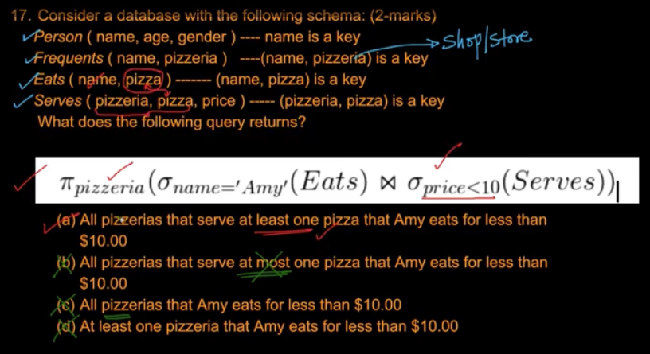
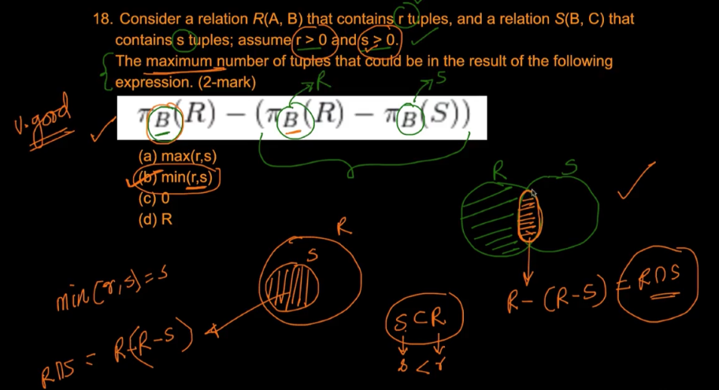
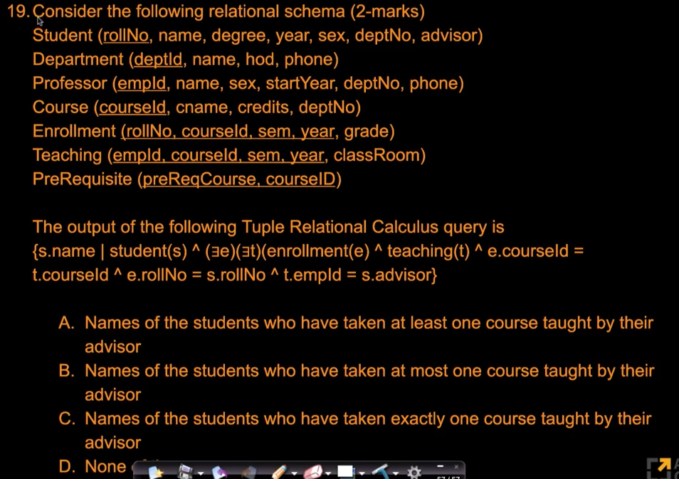
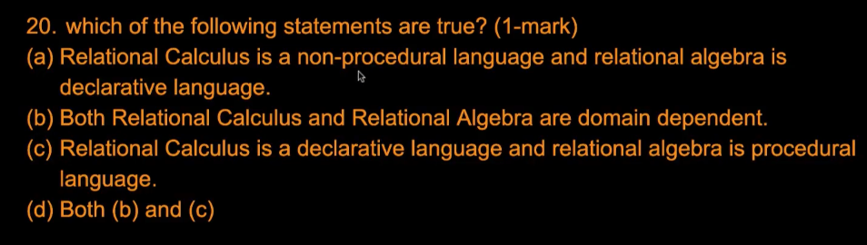

# 5. Solutions 3
Created Tue Apr 9, 2024 at 12:25 AM

Video: https://www.scaler.com/topics/course/dbms/video/478/

C and D are wrong sentences. B is wrong. So A is the answer.

---

Make the general two-touch diagram, then try to max the expression. Consider 2-touch, R subset of S, S subset of R. For maximizing, we need to avoid potential subtraction no matter what, so one has to be a subset of the other (since otherwise some value of R). This way min(r, s) becomes the answer, and no subtraction takes place.

---

Ignore the tables initially. Just look at the query, and pick out wrong ones. B and C are wrong since there's no mention of count (being <= 1 or == 1). 'A' seems to be correct, and since the words are used in the general sense, A is correct.

---

A is wrong. C is correct. And I don't know what B means. The answer is just C btw. GPT says "domain" here means "domain of application". Then, B is wrong since both languages are general purpose query languages. **Important.**
