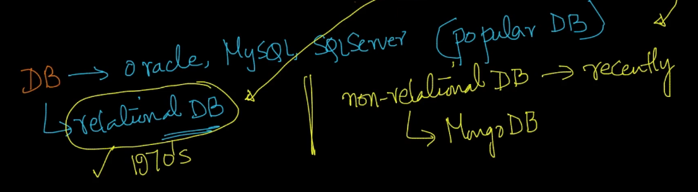
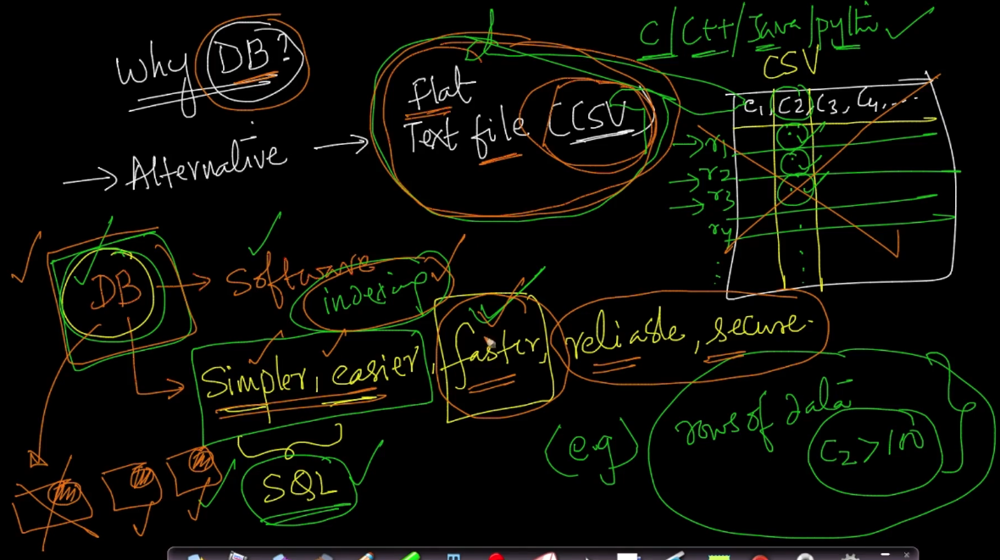
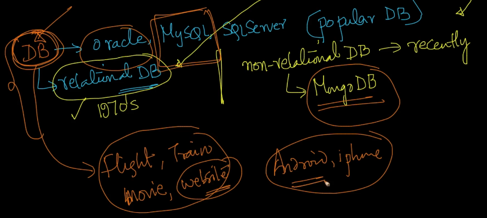
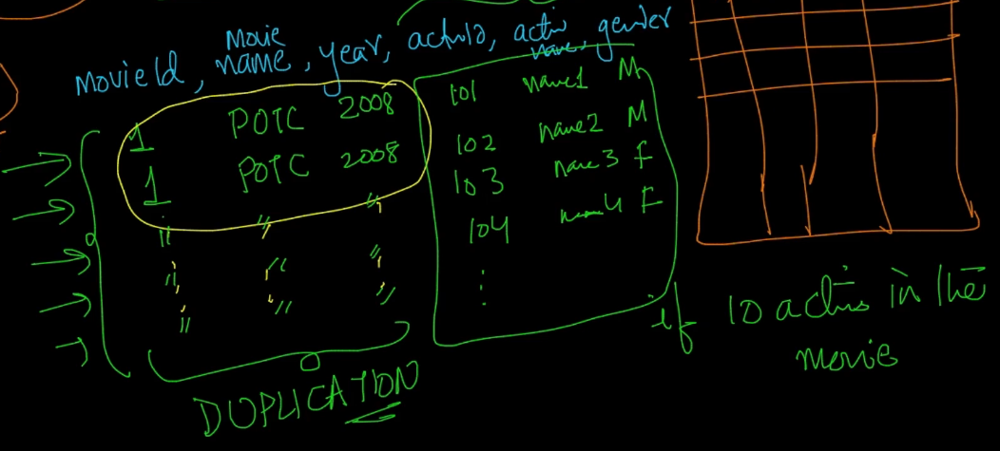
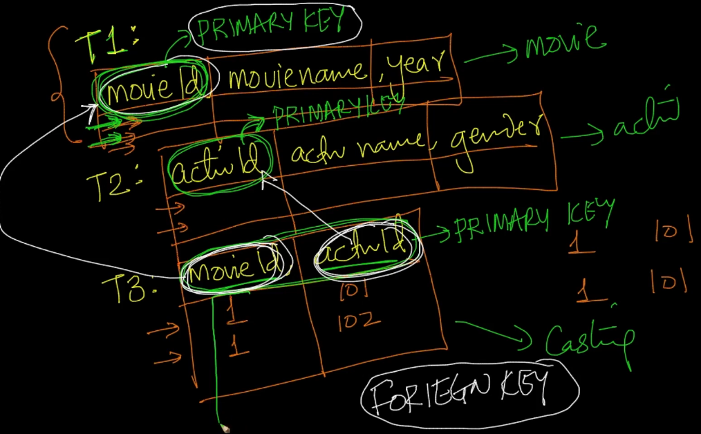

# 1. Overview of Databases for learning SQL
Created Tue Apr 9, 2024 at 2:37 PM

https://www.scaler.com/topics/course/dbms/video/479/

## Introduction to databases
Oracle, MySQL, SQLServer are some popular relational databases.
They have been used since the 1970s.

There are also non-relational databases like MongoDB.

Our discussion is limited to relational databases.

We'll learn about SQL which is meant for relational databases. But non-relational databases also usually have a language like SQL.

Knowing about SQL and some general concepts is useful when working with non-relational databases too.

## Why DB?
Alternatives to using databases - flat text files (say a CSV file).
Databases, as [discussed](../1-Introduction/2-Why-not-simply-use-files-Files-vs-DBMS.md) have characteristics which are difficult to have with flat files like:
1. Being simple
2. Almost no adhoc/glue code - since SQL is declarative.
3. Fast - due to standard structuring and indexes, and a lot of auxiliary data structures and algorithms working under the hood.
4. Reliable - auto-backups, movement and other common tools are available by default.
5. Secure - access control is a basic feature of databases
6. Distributed engineering is easy - many databases support multi-node architecture out of the box.

Example: In a table, you want to get rows which have a specific column value > 100. In files, this would take linear time, but in databases it would be quite faster due to indexes/range-queries (CHECK this)

In short, databases are powerful and easy to use, and their use has also penetrated all of technology. After operating systems, they are the most used software.

So learning and understanding them is essential.
## Databases are crucial, even direct business wise
In fact, a lot of multi-billion businesses like Oracle, or even new companies like MongoDB primarily do database work. All apps/experiences like flight bookings, movie tickets and websites's data is stored in databases. Even phones have databases, perhaps maybe a light version, called SQLite.

## Tables (recap)
- Tables are one of the essential construct for data storage, whether in file or database.
- The process used to avoid duplicate data in a database design is generally called "normalization". It can be thought of as a refactoring process.
  
- Primary and foreign keys
  