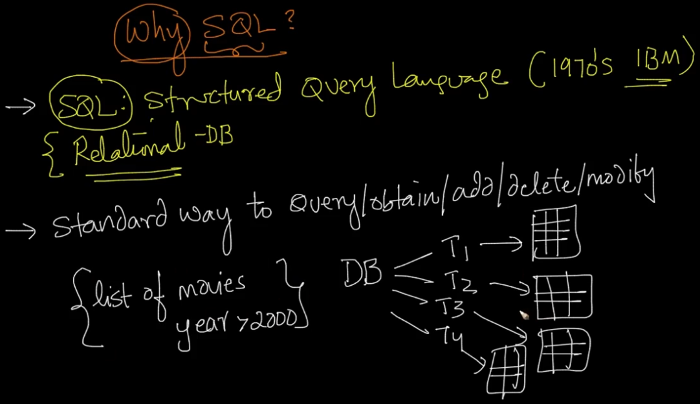
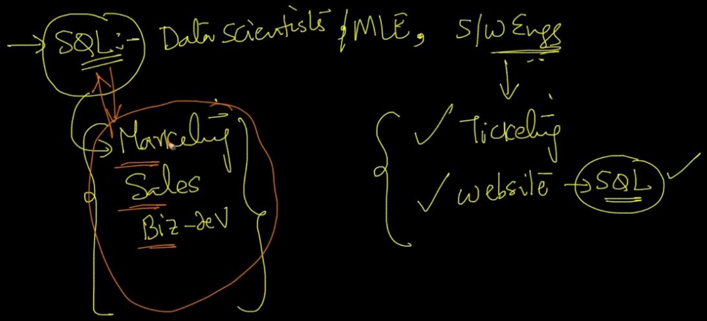
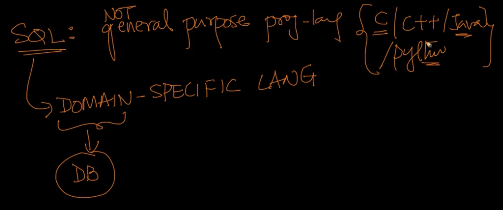
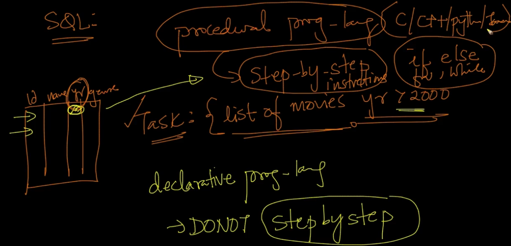
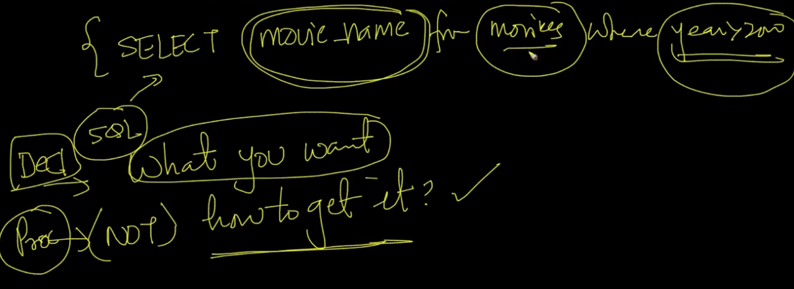

# 2. Why learn SQL
Created Tue Apr 9, 2024 at 3:51 PM

## SQL - why and what
SQL is a standard way to query/obtain/add/delete/modify.

- SQL is powerful - the best data-scientists and engineers use SQL day-to-day to get their tasks done. i.e. it is simple enough and expressive to be used in day to day work
- SQL is essential for apps/experiences - ticketing apps, educational course websites need SQL.
- SQL is essential in data driven projects - large companies and projects that rely on data use SQL extensively, almost all people here, whether they are engineers or not, use SQL like marketing, sales or biz-dev people.

## SQL is not a general purpose programming language
SQL is a DSL (domain specific language) for use in databases.

SQL cannot be used to build a web-server, game, operating system etc.
SQL's primary task is to add/query/delete/edit data in a database

## SQL is declarative
Given a query to get all movies that were released after year 2000, from a 'Movies' table.

And you were solving the problem using a procedural language like C/C++/Python/Java, your code would be the step by step instructions:
1. Load the file
2. In a loop, traverse over all movie rows, and check movie year, if > 2000, collect it (say in an array)
3. When the table is finished, return the array

But this is very simple in SQL, since it's a declarative language, i.e. you specify what you want, not how to it. Show below (there are no for loops, load instructions as can be seen):

## Conclusion
SQL is simple, easy and powerful.