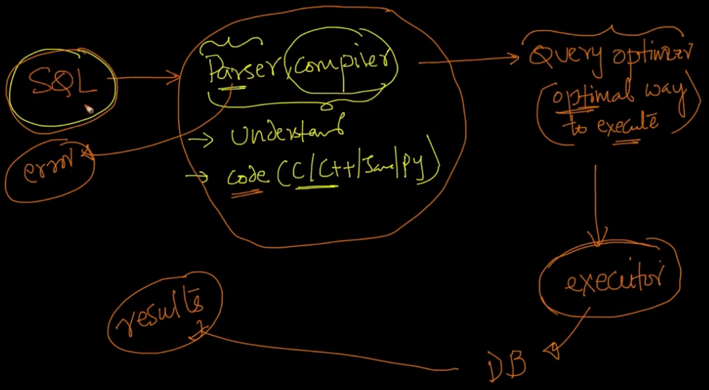

# 3. Execution of an SQL statement
Created Tue Apr 9, 2024 at 4:42 PM

Given SQL is a declarative language, how is an SQL statement executed exactly?
So each database (short for database runtime, since it is a runtime) contains lots of software, including components that interpret SQL into concrete instructions a CPU can run, i.e. there is a SQL -> general programming language, compiler involved here.

The DB also have a component called the query-optimizer which optimizes user given SQL code. This is a vast area and is usually handled at the Masters/PhD level.

Then there's a component that actually that runs it on the machine.

Of course, the exact working and implementation of the components vary in relational databases, but the input, i.e. SQL is a constant.