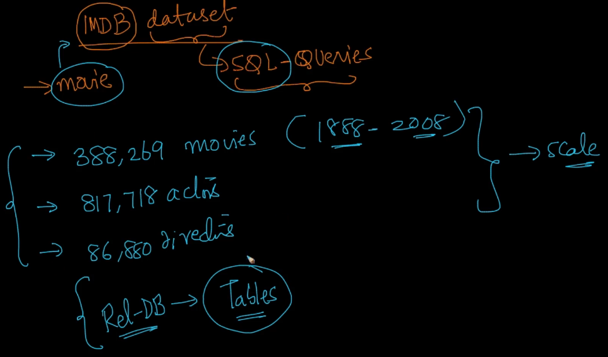
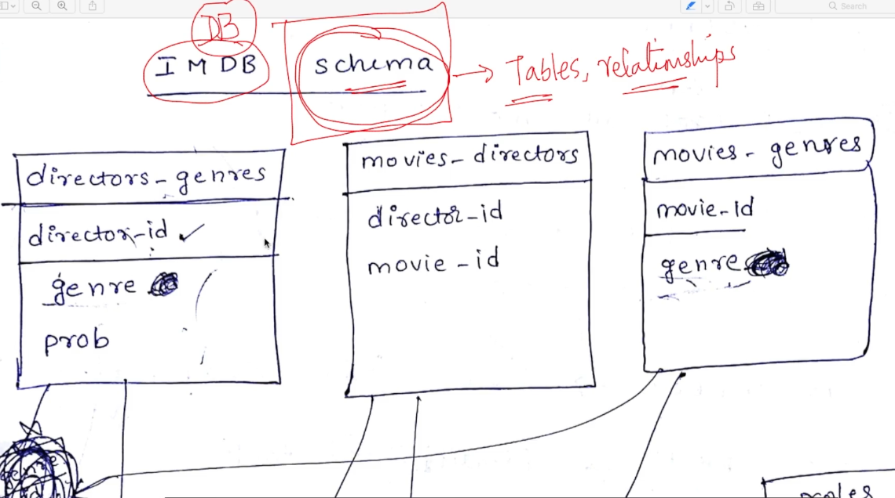

# 4. IMDB dataset
Created Tue Apr 9, 2024 at 4:53 PM

### About the IMDB dataset
We'll use the IMDB dataset to demonstrate and learn SQL.
It is a large and interesting dataset.

We'll also connect SQL query examples to real world problems like website design, data science etc.

### Schema
The schema of a database is a representation of all the tables and relations in a database.

The IMDB database has 7 tables.
