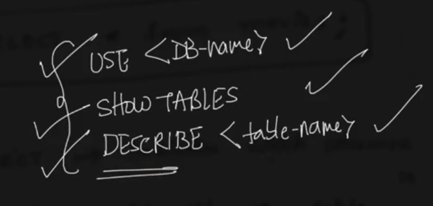

# 1. USE DESCRIBE SHOW TABLES
Created Tue Apr 9, 2024 at 6:55 PM

### Start SQL prompt
1. Enter `mysql -u root -p` into the terminal
2. Type/paste the root password
3. Done

## `SHOW DATABASES`
`SHOW DATABASES` is used to see all databases in the MySQL runtime (i.e. all databases on the machine).

```sh
mysql> SHOW DATABASES;
+--------------------+
| Database           |
+--------------------+
| imdb               |
| information_schema |
| mysql              |
| performance_schema |
| sys                |
+--------------------+
5 rows in set (0.05 sec)
```

## `USE {db_name}`
Switch to a database.



## `SHOW TABLES`
Show all tables of the current database.

```sh
mysql> SHOW TABLES;
+------------------+
| Tables_in_imdb   |
+------------------+
| actors           |
| directors        |
| directors_genres |
| movies           |
| movies_directors |
| movies_genres    |
| roles            |
+------------------+
7 rows in set (0.01 sec)
```


## `DESCRIBE {table_name}`
This command shows the schema of the table, i.e. field names, types and some more metadata.

```sh
mysql> DESCRIBE actors;
+------------+--------------+------+-----+---------+-------+
| Field      | Type         | Null | Key | Default | Extra |
+------------+--------------+------+-----+---------+-------+
| id         | int          | NO   | PRI | 0       |       |
| first_name | varchar(100) | YES  | MUL | NULL    |       |
| last_name  | varchar(100) | YES  | MUL | NULL    |       |
| gender     | char(1)      | YES  |     | NULL    |       |
+------------+--------------+------+-----+---------+-------+
4 rows in set (0.01 sec)
```

- 'id' is a primary key. 
- 'first_name' and 'last_name' is a string with max length 100. Also, these columns can have duplicate values (i.e. 'MUL' means multiple). They can have NULL value.
- 'gender' is a character, it can be NULL. It can also be repeated, even though the key `MUL` is not specified.

Note:
- The semicolon is important in SQL statements, however it is not required for some sentences like `USE database_name` (WHY?). Anyway, always use it for consistency and simplicity, no harm in that.