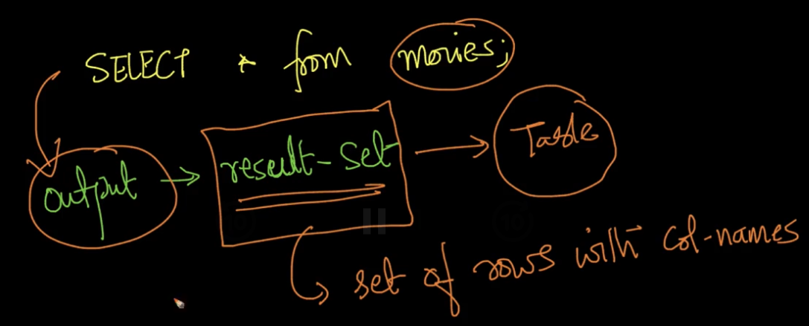

# 2. SELECT
Created Tue Apr 9, 2024 at 10:37 PM

Suppose we want to build an app from the given IMDB databases.
Lets try to learn SQL by solving some tasks that building an would involve.

## Task: List all movies
- `SELECT * FROM table_name` prints all the columns (and all the rows) of the table.
	- Doing `*` can be expensive since tables can have 100s of columns in reality
	- It is advisable to get only the columns that you need, instead of all columns. Even if the database is fast, network latency/cost may be high.
- SELECT col1, col2 from table_name prints just col1 and col2 columns (and all rows) of the table.

- Result-set: The output of SELECT query is called a "result-set" (set of rows), which is also a table.
- Order of columns in the result is same as the query (even if the order is different in the table). 
	- In case of `SELECT *`, the order of columns will remain same as the table. i.e. row order is preserved in `SELECT *`.

- If a requested column doesn't exist, you get an error.



(ignore LIMIT keyword here)
```sql
mysql> SELECT first_name, gender FROM actors LIMIT 2;
+------------+--------+
| first_name | gender |
+------------+--------+
| Michael    | M      |
| Eloy       | M      |
+------------+--------+
2 rows in set (0.00 sec)

mysql> SELECT gender, first_name FROM actors LIMIT 2;
+--------+------------+
| gender | first_name |
+--------+------------+
| M      | Michael    |
| M      | Eloy       |
+--------+------------+
2 rows in set (0.00 sec)

---

mysql> SELECT * FROM actors LIMIT 2;
+----+------------+--------------------+--------+
| id | first_name | last_name          | gender |
+----+------------+--------------------+--------+
|  2 | Michael    | 'babeepower' Viera | M      |
|  3 | Eloy       | 'Chincheta'        | M      |
+----+------------+--------------------+--------+
2 rows in set (0.00 sec)
```

### Conclusion
`SELECT` meant for projection (as defined in Relational algebra)