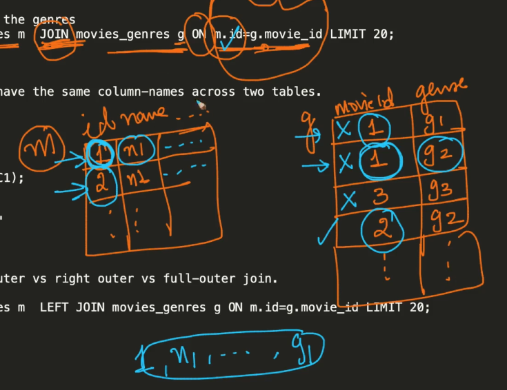

# 1. Join and Natural Join
Created Thu Apr 11, 2024 at 1:22 PM

## Situation
You have two tables, with some shared information, and you wish to complete info for each row by combining these tables. This is where the concept of JOIN comes in.

## JOIN in SQL
JOIN in SQL is almost exactly like relational algebra's join, i.e. you do a cartesian product but include only "sensible rows" (i.e. rows which have the same value for matching attributes). 

The difference is, that in SQL, you need to specify "sensibility criteria" since SQL allows complex sensibility criteria (instead of just equality like in RA) also. But the criteria is mostly equalities.

By default, all attributes from all tables are kept (they get concatenated). *This avoids the same-column multiple value ambiguity problem*.


## Syntax
Specify the tables involved, and the sensibility criteria for them (cover all combinations).
Also, since sensibility criteria involves value of different tables, it's usually preferred to have aliases for table names. The `SELECT` part also uses these aliases (yes right to left usage, ik).

Join part of the code runs during `FROM` (i.e. sources step). The syntax is in line with this.
```sql
SELECT m.name, g.genre 
FROM movies m JOIN movies_genres g 
ON m.id=g.movie_id;

-- specifically
FROM (A JOIN B ON sensibility_expression)
```

JOIN is also called 'inner join'.

- Note that JOIN happens first, then filtering (WHERE) and finally SELECT.

## Example
```js
mysql> 
SELECT m.name, g.genre
FROM movies m JOIN movies_genres g ON m.id=g.movie_id
LIMIT 20;
+-------------------------------------+-------------+
| name                                | genre       |
+-------------------------------------+-------------+
| #7 Train: An Immigrant Journey, The | Documentary |
| #7 Train: An Immigrant Journey, The | Short       |
| $                                   | Comedy      |
| $                                   | Crime       |
| $1,000 Reward                       | Western     |
| $1,000,000 Duck                     | Comedy      |
| $1,000,000 Duck                     | Family      |
| $10,000 Under a Pillow              | Animation   |
| $10,000 Under a Pillow              | Comedy      |
| $10,000 Under a Pillow              | Short       |
| $100,000                            | Drama       |
| $100,000 Pyramid, The               | Family      |
| $1000 a Touchdown                   | Comedy      |
| $20,000 Carat, The                  | Crime       |
| $20,000 Carat, The                  | Drama       |
| $20,000 Carat, The                  | Short       |
| $21 a Day Once a Month              | Animation   |
| $21 a Day Once a Month              | Short       |
| $2500 Bride, The                    | Drama       |
| $2500 Bride, The                    | Romance     |
+-------------------------------------+-------------+
20 rows in set (0.00 sec)
```


## Natural join (Same as RA, most automatic)
This is a special case of SQL join, where the sensibility criteria is equality (exactly like RA).
You just need to specify the tables, SQL will do the rest (will set sensibility criteria to exact match for common columns).
```sql
SELECT * FROM table_1 NATURAL JOIN table_2; -- no criteria specificed, so same-named column is used as sensibility criteria
```

- In natural join, you don't need to specify anything except the table, or in the worst case, need to specify the column name (if it's different in both tables) using the `USING` keyword. `ON` is not needed in natural join.
- The result set does not have duplicate columns for matching attributes, as usual join does. Makes sense since the join criteria itself is equality of common attributes.
- Joins can happen based on multiple columns, the `ON` becomes a `AND` condition instead of just equality. Anyway, even single AND is a equality expression.

## `USING` shorthand
If you want to join tables with a column that's named the same, you can skip providing the sensibility expression, instead just provide the column name.
```sql
SELECT * FROM table_1 JOIN table_2 USING (columnA); 
-- if simple equality criteria, `USING` keyword is enough (don't have to write the whole expression and use 'ON')
```

## Some clarifications on JOIN
- Joins in SQL are about equality - Even though you can write any "sensibility" criteria, it's usually an equality condition (instead of a comparison or something else). This is to prevent the ambiguous situation of which value (among differing) to show in the result-set.
- Differing columns in matching rows -  Not a problem since columns are concatenated, even if they have the same name. ~~SQL's only concern during a join operation is to ensure that the specified join condition is satisfied. If there are potentially differing values in sensibly matching rows, it will raise an error. To avoid the errors, it's up to the programmer to specify how those values should be handled in the query. This could involve selecting specific columns, using `SELECT` aliases or using aggregate functions to combine or summarize the values in some way.~~
  ```
	table1:
	+----+--------+
	| ID | columnB|
	+----+--------+
	| 1  |   10   |
	| 2  |   20   |
	+----+--------+
	
	table2:
	+----+--------+
	| ID | columnB|
	+----+--------+
	| 1  |   30   |
	| 2  |   40   |
	+----+--------+
	```
	```sql
	-- this would raise an error, if columnB value for matching rows differ
	SELECT table1.ID, table1.columnB, table2.columnB
	FROM table1
	JOIN table2 ON table1.ID = table2.ID;
	```
	```sql
	-- this is a workaround for the error
	SELECT table1.ID, table1.columnB AS columnB_table1, table2.columnB AS columnB_table2
	FROM table1
	JOIN table2 ON table1.ID = table2.ID;
	
	+----+---------------+---------------+
	| ID | columnB_table1| columnB_table2|
	+----+---------------+---------------+
	| 1  |      10       |      30       |
	| 2  |      20       |      40       |
	+----+---------------+---------------+
	```

## Conclusion
Use joins to combine data stored in separate tables.

Why do we have separated tables: to minimize redundancy, i.e. normalization results in separated tables.


## Extras