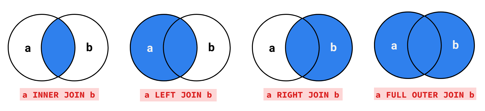

# 2. Inner Left Right and Outer joins
Created Thu Apr 11, 2024 at 4:20 PM

## Reading the Venn diagram
The sets in the Venn diagram in join diagrams represents columns involved in the input sensibility expression, other columns are not present here (they are present in the result-set of course).

## All types of joins (4)
A join B

- `NATURAL JOIN` - keep only sensible rows and sensibility criteria is common columns values must be equal. Same as RA.

If you give the sensibility criteria, the following are possible:
- `INNER JOIN` (aka `JOIN`) - only sensible rows are present in result-set. Common area in Venn diagram.
- `LEFT OUTER JOIN` (aka `LEFT JOIN`) - keep sensible rows as well as unmatched rows of A (fill holes with NULL). Circle of A in Venn diagram.
- `RIGHT OUTER JOIN` (aka `RIGHT JOIN`) - keep sensible rows as well as unmatched rows of B (fill holes with NULL). Circle of B in Venn diagram.
- `FULL OUTER JOIN` - keep sensible rows as well as all unmatched columns from A and B (fill holes with NULL). A union B in Venn diagram. *This is not available in MySQL*

## More operations
- `CROSS JOIN` - cartesian product
- Self join - not a keyword, but you just use the same table as join inputs.

## JOIN multiple tables
Joins can happen between multiple tables.
```sql
SELECT *
FROM 
table1 JOIN table2 ON table1.columnA = table2.columnA
	JOIN table3 ON table2.columnA = table3.columnA;


-- equivalent to the above, i.e. multiple-JOIN-one-ON
-- But I'll prefer the above step-based one, it's easier
SELECT *
FROM 
table1 JOIN table2 JOIN table3 
ON table1.columnA = table2.columnA AND table2.columnA = table3.columnA;
```

The evaluation semantics is serial order, i.e. (x JOIN y ON z) ... = result ....

I'll stick to this one-at-a-time approach since it's clearer.


## Cost of JOINS
- Joins can become too expensive, especially if indexing is absent/improper.
- Joins are usually the most time consuming jobs in a system. This matters in systems where latency is required
- Engineers usually try to avoid using joins, or make them faster using indexes.
